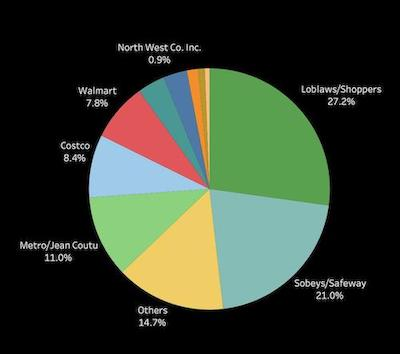
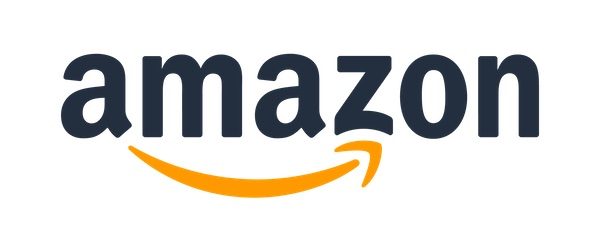
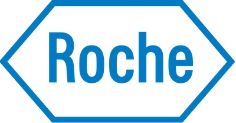
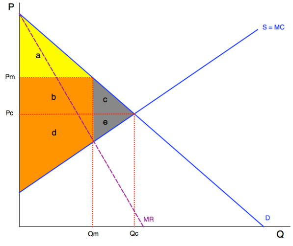

# Week 10

Single Firm Practices I

---

## Abuse of Dominance

<aside class="notes">

Single-firm practices that are anti-competitive.

Seems like it should be a primary tool in the competition law toolbox. But in fact it has historically bee quite an onerous charge to make out. 

Big changes: Bull C-56 

</aside>

--

**Is Loblaws' market power unlawful?**

<aside class="notes">

Key point: monopoly isn't unlawful in itself. But abuse of monopoly power might be. 

Example: Bureau launched an investigation into Loblaw's policies with respect to purchasing from its suppliers (e.g. compensation from supplier when another retailer's price for one of the supplier's products was lower than Loblaw's price)

</aside>

--

### *Competition Act*, s 79

<small style="text-align: left;">

79 (1) Where, on application by the Commissioner, the Tribunal finds that

(a) one or more persons **substantially or completely control**, throughout Canada or any area thereof, a class or species of business,

(b) that person or those persons have engaged in or are engaging in a practice of **anti-competitive acts**, and

(c\) the practice has had, is having or is likely to have the effect of **preventing or lessening competition substantially** in a market,

the Tribunal may make an order prohibiting all or any of those persons from engaging in that practice.

</small>

<aside class="notes">

3 steps:

1. "Substantially or completely control" a class or species of business: market share

2. "Engaged in a practice of anti-competitive acts": must be for anti-competitive PURPOSE. What is that purpose (e.g. incentivizing suppliers to raise prices on competitors or incentivizing suppliers to reduce rivalry between retailers, e.g. pressuring retailers to follow suggested price lists or adhere to certain advertising policies)? Is it possible that motivated by a pro-competitive purpose? 

3. "Preventing or lessening competition substantially": is there evidence of harm? 

Bureau concluded in 2017 that there was insufficient evidence to conclude that Loblaw's supplier policies resulted in a lessening of competition. 

</aside>

--

#### 79(1)(a) "Substantially or completely control"

<small style="text-align: left;">

A substantial degree of market power that "confers upon an entity considerable latitude to determine or influence price or non-price dimensions of competition in a market, including the terms upon which it or others carry on business in the market." 

</small>

<aside class="notes">

Factors the Bureau will consider:

- market share and barriers to entry (share >50% attracts scrutiny)

- ability to exclude competitors (e.g. by controlling inputs or platforms-doesn't meant that firm competes directly in the market)

- counter-veiling power of competitors and conditions for technological change 

</aside>

--

#### 79(1)(b) Anti-competitive Acts

<small style="text-align: left;">

Activities that have an anti-competitive purpose, i.e. one intended to have a negative effect on a competitor that is **predatory, exclusionary, or disciplinary**. 

</small>

<aside class="notes">

Predatory: pricing below cost to eliminate, discipline, or deter entry or expansion of a competitor (could include price discrimination?)

Exclusionary: non-price practices intended to exclude competitors (e.g. exclusive dealing; tying and bundling) - next day

Disciplinary: dissuading a competitor from competing (e.g. fighting brands; selling below acquisition cost) -- linked to collusive practices (disciplining members of cartel who deviate, e.g. by lowering prices) 

</aside>

--

#### 79(1)(c\) Competitive Effects

Does the impugned practice materially increase market power? 

<aside class="notes">

When will abuse of dominant position result in "preventing or lessening competition substantially in a market"?

Bureau looks to material increase in market power, particularly with respect to barriers to entry or expansion. Factors include:

- prices
- product quality and choice
- ease of switching between products or suppliers

As we saw in the Loblaws example, this can be hard to prove and often acts as a bar to successfully prosecuting a claim, even where dominance and anti-competitive purpose can be shown. 

</aside>

--

## Bill C-56

<small style="text-align: left;">

79 (1) On application by the Commissioner or a person granted leave under section 103. 1, if the Tribunal finds that one or more persons substantially or completely control a class or species of business throughout Canada or any area of Canada, it may make an order prohibiting the person or persons from engaging in a practice or conduct if it finds that the person or persons have engaged in or are engaging in

(a) a **practice** of anti-competitive acts; **or**

(b) **conduct** (i) that had, is having or is likely to have the effect of preventing or lessening competition substantially in a market in which the person or persons have a plausible competitive interest, **and** (ii) the effect is not a result of superior competitive performance.

</small>

<aside class="notes">

Key change is that CB now only needs to show (a) engagement in a practice of anti-competitive acts (like predatory pricing or price discrimination) OR (b) conduct that has the effect of preventing or lessening competition substantially. 

</aside>

--

#### Two practices today:

- predatory pricing

- price discrimination

---

### Predatory Pricing

Setting price below costs for a period of time sufficient to eliminate, discipline or deter a competitor in the expectation that the predatory firm will recoup its losses by charging higher prices later.

**Can you think of examples?**

<aside class="notes">

Intuitively, PP seems like a real threat and a key focus for competition law. 

But a considerable amount of ink has been expended to make the case the PP isn't really a problem. How do we know? 

</aside>

--

Do you think Amazon is currently engaging in predatory pricing strategies? How do you know and what if anything should be done about it? 

<aside class="notes">

EXAMPLE: Amazon pricing bestseller e-books at $9.99 (below cost at which they purchased from publishers)

Class 8 and this week, we saw that the conventional (Chicago) approach to this question is to ask: **is it rational for Amazon to engage in PP?**

Two aspects: (1) plausible theory that pricing below cost yields net benefits for Amazon? (2) other rationales for pricing below cost (e.g. loss leading?)

Khan argued that this conventional approach is inadequate to address the question of whether or not Amazon is engaged in PP. We want to understand both the Chicago approach and Khan's critique.

**Long purse:**

- Theory = predatory firm uses their resources from current position of market power to drive down prices and force competitors to exit.
 
- Harm: welfare loss from (1) monopoly pricing following exit of competitor firm(s); (2) during period of predatory pricing (price below cost, creating greater-than-optimal consumer demand)

Scepticism:

- Critique 1: Merger is always better than predatory pricing (predator always loses more than prey from increased production and selling at a loss with larger market share) -- although these mergers might be illegal + PP might be a rational step toward acquisition 

- Critique 2: irrational for consumers in the long run -- BUT free rider problem

- Critique 3: theory assumes that exit barriers are low (e.g. equipment can be repurposed easily), but if this is true then entry barriers are also probably low 

- Critique 4: costs of predation are immediate and certain but the benefits are over the long-run and uncertain (but of course uncertainty can work both ways, making predation more rather than less attractive)

- Critique 5: predatory pricing should never occur at all if parties have full information (prey should exit immediately if it knows it's ultimately going to fail) -- BUT threat of predatory pricing might be enough to drive out firms, meaning we should still make it illegal 

**Reputation**

- Theory = it's not the actual success of PP in pushing out a given competitor that's important, but rather the reputation for predatory behaviour a firm can acquire by engaging in PP (especially if predator operates in several markets at once)

Scepticism:

- paradoxical result of thinking about "N" markets = entrant will always enter in the "Nth" (last) market, which means no incentive to build reputation in the second-to-last market ... but result changes when "seeming tough" now has future expected benefits 

**Limit Pricing**

- Theory = incumbent firm sets prices low in order to discourage entry (scare off new entrants or to signal to existing competitor to exit sooner rather than later) -- may turn on asymmetrical information (i.e. potential entrant or competitor does not know incumbent's costs, but low pricing signals that it is a low-cost producer)

- Not clear that, on this theory, predatory pricing is actually bad -- really just a solution to problems of asymmetrical info

**Specific features of Amazon case:**

- steep discounting on platform-based goods creates higher risk of monopoly power (lock-in effects; ease of access to platform)

- recoupment: Amazon can recoup its losses by other means than simply raising prices in the future 

- Price trends are exceptionally hard to track / algorithm 

Khan's approach?

</aside>

--

Roche Pharmaceuticals gave away Valium for 12 months to hospitals when compulsory licencing was introduced. They later claimed they wanted to be a “good corporate citizen”. What further information would you need to know before making a claim that this behaviour is predatory?

--

#### What legal rule should we have for predatory pricing?

- *per se* legality 

- *per se* illegal

- presumption of illegality 

- two-stage

<aside class="notes">

**Per se legal**: PP basically isn't a problem, so pricing below cost should generally be allowed (even if it lets a few PP through)

- Basic argument is that low prices are the whole point of competition policy and don't want to deter this through false positives 

- A modified rule would be to disallow competitors from bringing complaints (let consumers do it) ... BUT, will consumers have the incentive to do this (at least in the short run)?

**Per se illegal**: to sell below average variable cost. 

- Are there legitimate reasons to price below cost? (e.g. perishable inventory; promoting new products; linked products such as razors and razor blades)

**Presumption of illegality** when price is below long-term marginal cost *intended* to eliminate competition 

- focus on long-term rather than short-term costs

- rebuttable presumption; element of intent 

**Two stage**:

- (1) assess whether market conditions suitable for PP to exist
- (2) price-cost test 
- seems to get closer to Khan's "structural analysis" 

</aside>

---

### Price Discrimination

Cineplex charges different prices for theatre tickets to students vs the general public. Airlines charge difference prices for economy vs first-class tickets. Should these practices be allowed? 

--

The online dating app Tinder uses an algorithm to set the price for in-app purchase based on a range of user data collected by the firm (age, geographic location, etc). Should we worry? 

<aside class="notes">

This looks a lot like "near-perfect" price discrimination, but real concern here might be about transparency and consumer choice (that consumers know personalized pricing is being applied so they can shop around if desired). 

Big issue in loyalty programs -- firms don't just get "loyalty", they get consumer data. Using these data firms can personalize rewards (e.g. Loblaws gives you a specific discount on tomatoes related to your purchasing behaviour) = "personalized pricing"

</aside>

--

### Price Discrimination

When a firm charges significantly different prices to two or more customers but where costs do not differ significantly (i.e. different ratios of price to marginal cost).

**What is the harm here?**

<aside class="notes">

Perceived harm = price discrimination must involve some exercise of market power (firm sets price above marginal cost for at least some customers)

- of course not all price differentiation is bad (e.g. when real cost difference between customer groups; absence of any price discrimination can signal cartel)

Firm must be able to (1) sort customers (high and low demand elasticity) and (2) prevent arbitrage 

KEY QUESTION: is price discrimination better or worse then exercise of monopoly power through single price (as in the base model)?

</aside>

--

Assume that a seller is able to perfectly price discriminate (i.e., charge each buyer the maximum price they are willing to pay). 

Should the Competition Bureau be worried about such conduct?

<aside class="notes">

No - this is allocatively efficient (equal to the perfect competition scenario, i.e. same level of output)

- Example of Cineplex charging $9 to one person and $15 to another (each pays their willingness to pay)

Yes - distribution problem = all consumer surplus under the perfect price discrimination scenario is captured by the producer (but no social welfare loss)

</aside>

--

<aside class="notes">

When a pure monopolist sets a single price, they earn monopolist profits but price out some lower-demand buyers altogether, leading to deadweight loss.

Here, higher-demand buyers (those who value the good more and can pay) enjoy some consumer surplus.

With some price discrimination, monopolist can increase profits while also increasing social welfare (serve some lower-demand buyers and reduce deadweight loss).

But price discrimination can also result in a reduction in the consumer surplus for some higher-demand buys compared to single-price scenario (and corresponding increase in producer surplus). 

</aside>

--

In what ways are airline tickets sold by class and discounted movie theatre tickets for seniors *different* forms of price discrimination?

Are either bad? Is one worse than the other? 

<aside class="notes">

2nd and 3rd degree price discrimination are what we normally think about as real-world price discrimination = seller finds strategies to sort buyers into rough groups. 

2nd degree: self-selection (seller chooses price-quantity-quality package to induce customer to reveal their type by the package they choose) = airline tickets 

3rd degree: seller-selection = seller sells identical quantity-quality packages to different types of customers at difference prices = seniors and student discounts at movie theaters (older people and students have higher elasticity of demand, so they are charged a lower price)

AMBIGUOUS welfare effects compared to single price case. 

- Welfare enhancing: imperfect price discrimination generally results in higher prices for buyers with low elasticity of demand and lower prices for buyers with high elasticity of demand -- eg. movie tickets -- (+ some people who are priced out of the market with a single price are served with segmented prices)

- Welfare reducing: may be a deadweight loss when there is only a small number of high-demand customers and a relatively low single price => discrimination results in loss of some customers and corresponding output reduction 

- May also be seller (social) costs associated with segmentation of the market (e.g. resources devoted to enforcing seniors/students discounts)

- Since price discrimination increases monopolist profits over the single-price scenario, firms may spend (waste) additional resources trying to attain market power.

</aside>

--

#### So why prohibit price discrimination?

<aside class="notes">

If the welfare effects of price discrimination are ambiguous, then why is it prohibited by law? 

Logic: price discrimination today may have adverse effects on market structure, so that competition tomorrow will be harmed.

Example: big retailers with monopsony power coerce suppliers into providing price reductions, resulting in smaller retailers paying prices that are too high to keep them in the market. 

- result is driving smaller retailers out of the market (maybe bad in itself) and driving up prices both the supplier and the big retailer can charge in the future (definitely bad)

- from perspective of the supplier, looks a lot like predatory pricing (pricing below cost for some retail buyers), with the same anticipated benefits (so why do we need a separate category of price discrimination?) 

ALSO: concern about the implications of prohibiting price discrimination for breaking up cartels (price discrimination is the basis for defection)

</aside>
