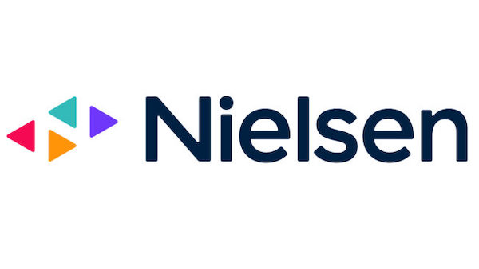
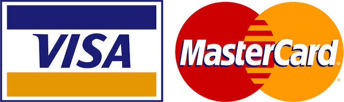
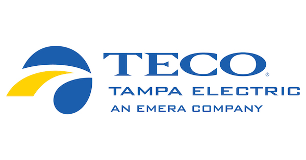

# Week 11

Single Firm Practices II

---

## Abuse of Dominance

<aside class="notes">

Single-firm practices that are anti-competitive.

Seems like it should be a primary tool in the competition law toolbox. But has been an onerous charge to make out. Major changes with the recent amendments.

</aside>

--

### *Competition Act*, s 79

<small style="text-align: left;">

79 (1) Where, on application by the Commissioner, the Tribunal finds that

(a) one or more persons **substantially or completely control**, throughout Canada or any area thereof, a class or species of business,

(b) that person or those persons have engaged in or are engaging in a practice of **anti-competitive acts**, and

(c\) the practice has had, is having or is likely to have the effect of **preventing or lessening competition substantially** in a market,

the Tribunal may make an order prohibiting all or any of those persons from engaging in that practice.

</small>

--

## Bill C-56

<small style="text-align: left;">

79 (1) On application by the Commissioner or a person granted leave under section 103. 1, if the Tribunal finds that one or more persons substantially or completely control a class or species of business throughout Canada or any area of Canada, it may make an order prohibiting the person or persons from engaging in a practice or conduct if it finds that the person or persons have engaged in or are engaging in

(a) a **practice** of anti-competitive acts; **or**

(b) **conduct** (i) that had, is having or is likely to have the effect of preventing or lessening competition substantially in a market in which the person or persons have a plausible competitive interest, **and** (ii) the effect is not a result of superior competitive performance.

</small>

--

### 79(1)(b) Anti-competitive Acts

Activities that have an anti-competitive purpose, i.e. one intended to have a negative effect on a competitor that is **predatory, exclusionary, or disciplinary**. 

<aside class="notes">

Predatory: pricing below cost to eliminate, discipline, or deter entry or expansion of a competitor. 

Exclusionary: non-price practices intended to exclude competitors (e.g. exclusive supply contracts)

Disciplinary: dissuading a competitor from competing (e.g. fighting brands; selling below acquisition cost) -- linked to collusive practices (disciplining members of cartel who deviate, e.g. by lowering prices) -- also intended to *reveal information* about other firms in cartel

Week 10: "predatory" behaviour, i.e. predatory pricing (pricing below cost to drive out competitors so that can ultimately establish a higher monopoly price).

Key policy question = when we see a firm like Amazon with low prices, is it likely that they are engaged in predatory behaviour? Is there an economic theory to support such behaviour? 

Second topic = price discrimination (economy and first-class tickets; discounts on theater tickets to students and seniors)

"Perfect" price discrimination is allocatively efficient (but distributively problematic). 

Less-than-perfect discrimination has ambiguous efficiency effects, but raises challenges for small businesses (e.g. if suppliers price discriminate between large and small retailers, could be unprofitable for the latter)

</aside>

---

## Exclusionary Conduct

What is Nielsen doing that potentially falls under section 79? Any justifications for these practices? 

<aside class="notes">

SYNOPSIS: Nielsen produces market tracking/data services for the retail grocery and drugstore sector. It buys scanner-based data from both retailers and uses these data to generate market reports which it sells to manufacturers. 

Nielsen is sole supplier of these services in Canada (but has large competitor, IRI, in United States). 

What is Nielsen doing that potentially falls under abuse of dominant position in section 79?

- signing exclusive contracts for scanner data with retailers and offering financial inducements to retailers to do so;

- entering long-term contracts with manufacturers of consumer packaged goods, who buy Nielsen scanner-based market tracking services

WHAT'S THE PROBLEM?

- Exclusivity contracts on sellers effectively lock out new entrant buyers because they can't get a toehold (need a certain comprehensive access to several data sources to enter), resulting in higher prices for scanner data and ultimately higher prices for Nielsen's products

- Tribunal notes that there are no justifications based on need to protect up-front investments in technology or guard against free riding (goes to intention)

- Tribunal also dismisses data privacy concerns (retailers don't need exclusivity contracts to achieve this)

EFFICIENCY:

- Nielsen's argument that competition between Nielsen and IRI for exclusive contracts is efficiency-enhancing ("competition for the market")

- Rolling contracts mean that any new entrant would need to enter the market gradually by competing on each contract as it comes up

- Key PROBLEM with Nielsen's argument is that incumbent monopolist can always afford to pay higher price for a supplied product than in a duopoly (prices and therefore profits for the products produced by the duopolists will be lower). Tribunal skeptical that this argument applies where products are complimentary and highly differentiated (i.e. not really duopolists at all in the same market)

- Result (based on Australian and New Zealand experience) seems to be that competition for exclusives results in sole monopolist provider 

- BUT: what about argument that higher price paid to retailers for their data gets passed on to grocery/drug customers? (Tribunal says no evidence -- how would this enter into retailer's pricing decisions?)

PROCESS:

Was IRI was using the Bureau as a "pawn" to carry out its business purposes? Was IRI adjusting its business strategy wrt entering Canada in anticipation of the Bureau's case? How vulnerable is the Bureau to this type of behaviour?

</aside>

---

## Vertical Restraints

Intrabrand vs interbrand

<aside class="notes">

Refers to a whole range of practices in which some upstream firm imposes contractual or other restrains on a downstream firm. 

Not necessarily linked to "market dominance" as in AoD cases under s 79. 

Intra-brand competition: focus on competition among distributors or RETAILERS of the same branded product or substitutable products. E.g. same branded shoes sold at a lower price in a low-end shop vs an upmarket shop. 

Inter-brand competition: focus on competition between SUPPLIERS or resellers of the same brand or companies that have developed brands or labels for their products in order to distinguish them from other brands sold in the same market segment. An example of inter-brand competition will be Coca-Cola versus Pepsi.

We will cover two specific scenarios: 

(1) Resale price maintenance -- when upstream seller sets resale price for downstream seller (generally a price floor, but sometimes a ceiling). Question is impact on competition between downstream retailers (intra-brand).

(2) Exclusive dealing and tying -- when upstream seller requires downstream firms to deal only in certain products or when seller bundles products together. Question is impact on competition between sellers of differently branded products (e.g. blocking new entrants) (inter-brand).

</aside>

--

What is resale price maintenance? Why does the Commissioner's case against Visa+Mastercard fail? 

<aside class="notes">

**What is RPM?**

Occurs when an upstream firm (e.g. a manufacturer) controls, by contract, the price at which downstream firms (e.g. retailers) are permitted to sell its products.

- Commissioner argues that Visa imposes contractual terms on Acquirers that effectively set a floor on price of credit card network services offered to Merchants

- Contractual terms prevent Merchants from, e.g., offering discounts to customers for using lower-cost cards or from refusing certain high-cost cards 

Provisions banning RPM introduced in the 1960s and had a dramatic effect on business practices. Businesses had previously been widely engaged in various forms of RPM. 

Now covered by Section 76 (Price Maintenance). Civil provision under which Tribunal can issue an order to stop or modify the impugned activity. 

**Why does Commissioner fail?**

**"Resale"**: Commissioner's case fails because Tribunal rejects idea that Acquirers simply resell credit card network services produced by Visa/Mastercard. So doesn't meet requirements of s 76.  

LESSON: RPM can potentially take many forms, but characterizing them as such might be unsuccessful in more complex market arrangements. 

ASK: why should it matter for the purposes of a section 76 claim that Acquirers provide a "bundle of services" beyond the network services produced by Visa? Isn't the key point that contractual requirements put upward pressure on prices paid by Merchants? 

ASK: assuming that Acquirers meet the resale requirement, are Visa's practices "bad" here ("an adverse effect on competition in a market" under s 76)?

</aside>

--

Suppose that Dell imposes a contractual term on retailers (e.g. Staples, Best Buy) that establishes a minimum price at which its laptop computers can be sold. 

Why would Dell do this? Should it be allowed?

<aside class="notes">

Starting point: in a perfectly competitive market without transaction costs, RPM wouldn't have a clear economic rationale 

- manufacturers would always sell at marginal cost and would have no market power to enforce a contract for higher price

But a firm having market power alone isn't sufficient to explain RPM. Once manufacturer has set the wholesale price, their profit is MAXIMIZED by lowest possible retail price (higher quantity will be sold b/c downward sloping demand). 

So why set vertical price floors on downstream retailers? 

**Anti-competitive explanation:**

- Cartel pricing by manufacturers (e.g. Dell and Levano) (need to stabilize retail prices because wholesale prices are hard to monitor, which is crucial for maintaining a cartel)

- Cartel pricing by retailers (Staples and Best Buy) (established retailers use manufacturers to coordinate cartel prices at the retail level and thereby blocking new low-cost/discount entrants -- idea is to get the manufacturers to set a price floor that would be unprofitable for new discount entrant)

**Efficiency explanation:**

"Service/availability hypothesis" = basic idea is that a higher retail price will increase the margins of retailers and therefore gives them incentives to attract additional customers by providing services associated with the product or increasing access (e.g. providing more retail outlets)

- Why wouldn't retailers just do this on their own? Possible answer = "free riding" (e.g. store that offers advice/showroom/etc vs out-of-crate retailer, a positive externality). 

More general explanation = when it is easier/cheaper/more effective to compete on price rather than service, retailers will choose the former. RPM is therefore an efficient means to induce retailers to compete through enhanced service. 

- Information/monitoring costs are also part of the explanation for why manufacturers use RPM: price floors make it easier for manufactures to monitor and enforce a contractual term on retail prices (as compared to monitoring service quality)

</aside>

---

## Exclusive Dealing (Interbrand)

<aside class="notes">

Cases where upstream seller requires downstream firms to deal *only* in certain products.

- Simple example: seller imposes a term on buyer that it will not carry competing brands.

As we saw in Nielsen, also occurs reverse (EXCLUSIVE SUPPLY): buyer imposes a term on seller that it will not sell product to competitors = dealt with as abuse of dominance under section 75.

Exclusive dealing covered by section 77.

</aside>

--

Why would TECO enter into an exclusive contract to purchase all its coal from Nashville Coal Co. for 20 years?

<aside class="notes">

No express term that TECO would purchase all it's coal from Nashville, but provision that had effect of requiring TECO to purchase all coal from that supplier for 20 years for particular plant/unit. 

Nashville brings case to invalidate contract on the basis that it is anti-competitive (i.e. wants to get out of the contract).

Petitioner (Nashville) argues that buyer (TESCO) is prevented from purchasing from other suppliers, which reduces competition on its face in the relevant market (which they say is, e.g. purchasing area in Florida).

Two issues:

1. Market definition (buying area vs producing area -- USSC says it's the buying area and therefore contract represents small fraction of the coal sold, less than 1 percent) -- NB that District Court's emphasis on buying area basically amounts to recognition that all transactions include an "exclusive" element

2. Anti-competitive effects 

**What are the anti-competitive effects?**

- on buyer subject to the contract? if the seller has market power, wouldn't they just raise the price in the absence of the exclusivity clause?  

- on other buyers in the market? theory that exclusives allow seller to exploit "reverse free rider problem" among buyers = when a buyer signs exclusivity contract, it imposes a cost (externality) on all other buyers by increasing the risk of not being party to contract and therefore facing higher prices in the future (if no new entrants emerge to compete and the seller has increased market power as a result of the contract). Seller uses this reverse free rider problem to incentivize other buyers to sign. 

**What are the efficiency explanations (from buyer's perspective)?**

- **Stability**: USSC in *Tampa* = contract assures supply of coal to buyer for 20 years provides stability/certainty in context of public utility in the "public interest" (is this about "efficiency" or something else?)

- **Investment**: when buyer needs to invest a lot in specific assets (like power plant) to make use of the product, exclusive supply contract can address disincentives to invest

- When agent carries more than one competing product, there is the danger of "free riding" by sellers on the expenditures of other seller -- e.g. insurer who advertises and brings customers into agent, who then purchase a competing product 

- "Potential competition" -- exclusive dealing contracts induce sellers to cut wholesale prices dramatically (to induce buyers to enter contract), therefore resulting in lower prices to consumers (THEORY is that price is disciplined by 'potential competition' rather than 'actual competition' between competitors )

</aside>

--

Your bank tells you that you qualify for a home mortgage, but says that it will only approve the mortgage if you transfer all your investments to the bank or its affiliates.

**Should such conduct be allowed?**

<aside class="notes">

**Tied selling**

Aftermaket example: buying a photocopy machine comes with requirement to buy repair services.

Why would firms do it?

- shared costs or risks (banking example, warranty service)

- product information: buyers of photocopiers don't know if their machine is breaking down because of a bad product or bad service, so reputation of producing firm suffers. Firm therefore has in interest in servicing the machine itself.

- sorting problems: prevents buyers from "cherry picking" lower-quality items when there are significant sorting costs for the seller (diamonds example, sold in lots)

</aside>

--

Should we be worried more about intrabrand or interbrand vertical restraints?