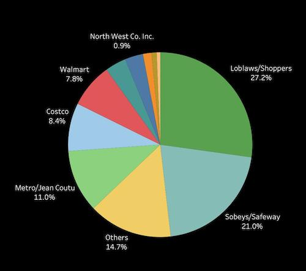
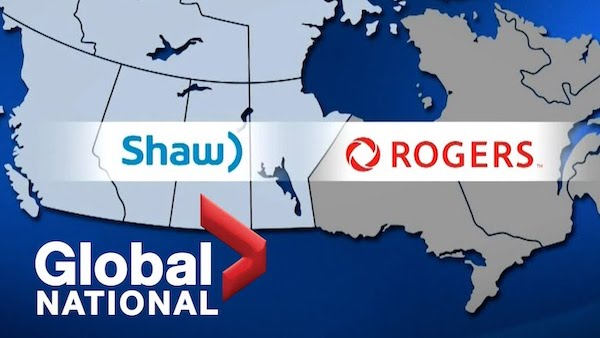

## Week 6

### Mergers I

--

#### *Competition Act*, RSC , 1985, c. C-34, s 92

<small>

> 92 (1) Where, on application by the Commissioner, the Tribunal finds that a merger or proposed merger prevents or lessens, or is likely to prevent or lessen, competition substantially [...]

</small>

<aside class="notes">

Key role of CB and CT is merger review: to determine whether a merger is likely to create, maintain or enhance market power

Key test: prevents or lessons competition substantially. 

</aside>

--

Why exactly might we be worried about mergers?  

<aside class="notes">

Get the students to try to identify coordinated and unilateral effects. 

- coordinated: collusion concerns
- unilateral: monopoly power by merged entity alone
- pitofsky point: political influence 

</aside>

--

### Two Steps in Merger Analysis

1. Defining relevant markets

2. Assessing competitive effects

<aside class="notes">

Purpose of step 1: identify set of products that customers consider to be substitutes for those produced by the merging firms and the set of buyers who could face increased market power as a result of the merger.

"Fuzzy" exercise = not aiming for a precise definition as an end in itself, but using this to assess competitive effects.

At step 2, and with market definition in mind, analysis turns more directly to competitive effects of the merger by (a) developing a theory of competitive harms and (b) assessing any offsetting efficiencies.

</aside>

---

## Market Definition

EXERCISE: b.socrative.com/login/student/

Room name: BAXTERDAL

--

How do "market power" and "market share" relate to "market definition"? 

<aside class="notes">

PURPOSE of defining a market is to assess the potential market power exercised by the merged entity (i.e. anti-competitive effects).

- To do so, need to define the smallest market in which the merged entity COULD exercise market power (e.g. in which there aren't so many product substitutes that its simply impossible for the merged entity to exercise such power)

- Whether or not the merged entity DOES exercise such power is the subject of the second stage, anti-competitive effects analysis 

Market power is defined by the merged firm's ability to profitably raise prices (and sustain those prices). More often then not, we can't measure market power directly -- instead, we use MARKET SHARE as a proxy.

Market share (of the merged entity) is defined by the share of the firm's sales in the relevant market. That relevant market--and the firm's "power" of that market--is determined by the presence or absence of substitutes in that market for the firm's products.

--

### Narrow vs Broad Definitions

If two Nissan dealers are thinking of merging in Mississauga, why isn’t it correct to analyze the competitive effects on the “retail market for Nissan cars in Mississauga”?

<aside class="notes">

If market is defined too narrowly, it will not include close substitutes. So we will get a distorted view of the merged firm's market share and thus their ability to set monopoly prices in that narrow market.

- E.g. if there are several close substitutes for Nissan cars beyond the retail market for Nissan cars in Mississauga (Volvos in Mississauga; Nissan cars in Vaughan), but we exclude these from the relevant market, the merged firm will appear to be a virtual monopolist for the purposes of merger review--when in fact they might have very little market share/power.

- Result: if we define the market too narrowly, we'll tend to disallow mergers even though the competitive effects are nil.

- BUT flip side: if we define a market too broadly, merged firms with significant market power might pass review too easily.

ASK: are parties to a proposed merger likely to argue for a narrower or broader market definition?

- e.g., *Superior Propane* (propane vs all fuels)

- CB challenging the merger argues for narrower definition (easy to make the case that merged firm has market power)

- Respondent merging parties argue for broader definition

</aside>

--

### Merger Enforcement Guidelines (MEGs)

<small>

> 4.3 Conceptually, a relevant market is defined as the smallest group of products, including at least one product of the merging parties, and the smallest geographic area, in which a sole profit-maximizing seller (a “hypothetical monopolist”) would impose and sustain a small but significant and non-transitory increase in price (“SSNIP”) above levels that would likely exist in the absence of the merger.

</small>

<aside class="notes">

Describe briefly what the MEGs are.

In past few decades, market definition has converged around a fairly precise method: relevant market is smallest market in which a HM would impose and sustain a SSNIP (5% over a year).

</aside>

--

### Hypothetical Monopolist Test (HMT)

<aside class="notes">

Implicitly undertook the HMT analysis in the Socrative exercise. 

HMT = method for defining a market in which there are no product substitutes close enough to thwart exercise of market power by a monopolist in that market

- start by postulating a candidate market controlled by HM; if HM cannot impose a SSNIP (because there are viable substitutes), then add the next-best substitute

- keep going until reached a group of products in which HM can impose a SSNIP (i.e., there are no sufficiently close substitutes left)

- same basic idea for defining geographic market

</aside>

--

### Defining substitutes 

How do we identify **substitutes** for the purpose of the HMT analysis? 

<!-- "Let’s suppose cats never eat dog food and dogs never eat cat food. Can we ever consider them to be substitutes for the purposes of market definition in competition policy?"

"Indirect constraints" = relevant when the merger is taking place with respect to an input/wholesale market. Suppose that the merger is between firms that supply inputs to make both dog and cat food. Then these should be considered substitutes in defining the relevant market for ... -->

<aside class="notes">

ASK: in our Nissan exercise, how did you decide whether a Volvo was a substitute? A Lamborg? A bike?

Options:

- Statistical measure: cross-elasticity of demand = measures the change in quantity demanded of one good in response to a change in the price of another good (measure is POSITIVE for substitutes)

- Functional interchangeability: are end-uses of the products the same? how similar are their physical and technical characteristics?

- Other contextual indicators, such as presence of "switching costs", which would cause buyers not to purchase products that are functionally interchangeable. (e.g. specialized equipment needed in processing)

</aside>

--

# $E = \frac{\triangle Q_a}{\triangle P_b}$

(cross-elasticity of demand)

--

### Substitutes in *Southam*

Do you agree with the Tribunal in *Southam* that the community newspapers and daily newspapers were not substitutes? 

<aside class="notes">

Challenges of identifying proper substitutes illustrated in *Southam*

FACTS:

- Southam owns two daily newspapers that are not doing well -- company views this as consequence of strong community newspapers in lower mainland.

- Southam (1) starts flyer distribution and (2) competitor community newspapers ("North Short Extra"). Then starts to acquire various community newspapers and eventually shuts down its flyer and NSE publicaitons.

ISSUE: were Southam's newly acquired community papers substitutes for its existing dailies? (if so, Southam's market share = market power in the relevant post-merger market would be much higher)

- Tribunal concluded that Southam's purchase of community newspapers had not substantially lowered competition in the "retail print advertising market in the lower mainland", which excluded the Vancouver dailies 

- FCA disagreed with this market definition and thought dailies should be included 

ASK: How did the Tribunal determine that dailies and community papers weren't substitutes? 

- No direct evidence of cross-elasticity of demand (not uncommon)

- Functional interchangeability (end use or purpose): papers served different purposes (large advertisers vs smaller local advertisers) -- SCC says all depends on how you define "purpose" (broadly or narrowly -- cars and tanks example), and acknowledges a certain circularity in using purposes to define substitutability while requiring some prior assumptions about substitutability to define purposes 

- Southam's own and competitors' beliefs that these papers were in competition (e.g. Southam's US expert): firms assessing this question could answer it in different ways for different purposes -- SCC says that this conclusion might seem unusual (especially in the face of Southam's own expert analysis), but it was not "unreasonable" in administrative law terms 

</aside>

--

### Substitutes in *Superior Propane*

What is the difference between **cross-price elasticity** of demand and **own-price elasticity** of demand? Which one should apply for the purposes of defining a market? 

<aside class="notes">

In *Superior Propane*, issue is whether propane (and associated products) is its own market, or whether other fuels (like natural gas) should be included in relevant market. 

- CB: propane
- SUP: all fuels

KEY MESSAGE: don't get caught up in market definition as end in itself -- need to get clear on the purpose of employing different economic tools.

Cross-price elasticity = change in demand for focal product given change in price of another product 

Own-price elasticity = change in demand for focal product given change in price for that product

CPE = used for IDENTIFYING close substitutes to include in relevant market; set of pair-wise comparisons does NOT measure market power directly

OPE = measures market power directly -- e.g., if demand for product is inelastic/insensitive to changes in its price, then firm exercises market power to set monopoly prices 

Because we are trying to define the SMALLEST possible market in which the merged entity could exercise market power, OPE is sufficient if on the evidence it is sufficiently INELASTIC (i.e. direct evidence of monopoly)

Only when such OPE evidence isn't available or doesn't exit, then pairwise comparisons in CPE become relevant. 

On the evidence in *Superior Propane*, demand for propane is inelastic to changes in its OWN price, thereby indicating significant market power on the part of pre-merger firms. 

- Tribunal's conclusion: evidence shows that propane demand is inelastic with respect to its price over the relevant time period and therefore propane is the relevant market (Bureau's argument)

<!--CAVEAT: this analysis fails when the pre-merger price was already above marginal cost, i.e. already the result of monopoly power = cellophane fallacy-->

</aside>

--

### *Cellophane* Fallacy

Why might it be an error to define a product market as "flexible wrapping materials" based on high cross-elasticity of demand between cellophane and other flexible wrapping materials? 

<aside class="notes">

Because if firm producing cellophane (e.g. Saran-Wrap) currently has substantial market power, they will have raised prices to point where MC=MR. 

This means that prices are already high enough to create a substitution effect between cellophane and other flexible wrap. I.e. at monopoly prices, there are a lot of close substitutes for cellophane. 

Engaging in the *Cellophane* fallacy means that current monopolists will always have markets defined too broadly, making it too easy for them to pass merger review.

Correct approach is to ask whether there are close substitutes at COMPETITIVE prices. 

- In other words, interchangeability at the current (monopoly) price might not demonstrate an absence of market power--but in fact be a SYMPTOM of market power already established 

</aside>

---

## Competitive Effects

--

#### *Competition Act*, RSC , 1985, c. C-34, s 92

<small>

> 92 (1) Where, on application by the Commissioner, the Tribunal finds that a merger or proposed merger prevents or lessens, or is likely to prevent or lessen, competition substantially

</small>

<aside class="notes">

Recall key standard = focus of analysis on whether merger prevents or lessens competition. 

</aside>

--

<!--#### *Competition Act*, RSC , 1985, c. C-34, s 92(2)

<small>

> 92 (2) For the purpose of this section, the Tribunal shall not find that a merger or proposed merger prevents or lessens, or is likely to prevent or lessen, competition substantially solely on the basis of evidence of concentration or market share.

</small>

<aside class="notes">

At odds with s. 1? (Maybe: protecting smallness is a purported purpose in s 1)

At odds with exercise in market definition? (No: market definition establishes relevant scope of analysis, but CA points to other factors to consider in ultimate inquiry)

</aside>

-- -->

Why are we worried about mergers? Why do we think it will result in competitive harm? 

<aside class="notes">

Revisit question from start of class.

</aside>

--

### Two Theories of Harm

- coordinated effects 

- unilateral effects

<aside class="notes">

Basic idea = effect of merger on market power is easy to assess in extreme case of duopoly to monopoly (prices rise)

But in less concentrated markets with low barriers to entry, effect of merger is more difficult to assess. 

Two theories:

- coordinated effects: assesses whether merger will result in greater collusion (esp tacit collusion) by eliminating a competitor or making it easier for remaining firms to cooperate

- unilateral effects: assess whether the post-merger firm will lead to higher prices due to lower own-price elasticity of demand 

- coordinated effects used to be the main focus of merger analysis, but past few decades have seen much greater focus on unilateral effects 

</aside>

--

### Unilateral Effects

<aside class="notes">

Basic idea: these are "static" models that ignore most of the dynamic aspects of oligopoly that we studied a few weeks ago (i.e. insight that firms in oligopoly account for and respond to one anothers' changes in output)

Static model asks about the effect of the merger in terms of how changes in price by one firm will impact demand conditions (consumer behaviour) in the market.

When goods are perfectly homogenous, duopoly is sufficient for perfect competition (think Coke and Pepsi).

When goods are not homogenous, demand consequences of price increase by one firm are more complicated. 

Basic idea: pre-merger, if one of the merging firms raises its prices, some of its demand will be lost (diverted) to the other merging partner. The merger itself internalizes these consequences, thereby increasing the merged entity's market power. 

So, for example, data on how many customers would switch between merging firms pre-merger (diversion ratio) can help us to assess consequences of merger in quantitative terms. 

Without these data, we'd ask: (1) how close are the two firms' substitutes? (2) how big was the firms' market share pre-merger? (which affects ability to capture diverted customers) (3) how concentrated was the rest of the pre-merger market? (4) host of other factors 

</aside>

--

### Coordinated Effects 

<aside class="notes">

Focus here is not the affect of the merger on consumer behaviour, but on consequences of the merger for the behaviour of other firms -- namely, in terms of explicit or tacit collusion. 

KEY LINK BACK TO WEEK 4/5: 

- We saw that law on horizontal restraints struggles to detect tacit collusion, and to deal with it effectively 

- Merger policy makes available a "structural remedy" to deal with tacit collusion -- i.e. a way to change the structural conditions in the market to make collusion more difficult 

So focus here is on the market conditions that favour or disfavour collusion (three cartel problems from Week 4) = (1) reaching an agreement; (2) monitoring defections; (3) punishing defectors 

</aside>

<!--

NOTES!

- check that socrative quiz is workign properly -- the results don't show in a sensible way. Better way to do this exercise?

- I floundered on the idea the CB always argues for narrower market definition while Repondent aruges for broader definition. Is this true of Southam?

- The market definition stuff is good but need the price elasticity and theory of harm stuff to hang together better. 

-->