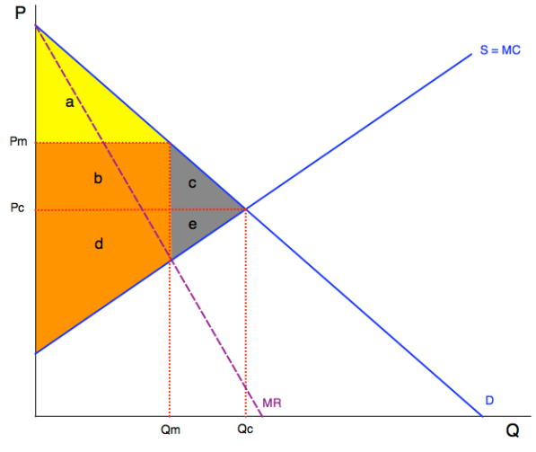

## Week 7

### Mergers II

--

### Two Steps in Merger Analysis

1. Defining relevant markets

2. Assessing competitive effects (and efficiencies)

<aside class="notes">

Last week: market definition

This week: competitive effects (and associated efficiency defence)

</aside>

--

#### *Competition Act*, RSC , 1985, c. C-34, s 92

<small>

> 92 (1) Where, on application by the Commissioner, the Tribunal finds that a merger or proposed merger prevents or lessens, or is likely to prevent or lessen, competition substantially [...]

</small>

<aside class="notes">

92(1) = requires assessment of anti-competitive effects of the merger

</aside>

--

#### *Competition Act*, RSC , 1985, c. C-34, s 96 [repealed]

<small>

> 96(1) The Tribunal shall not make an order under section 92 if it finds that the merger or proposed merger in respect of which the application is made has brought about or is likely to bring about gains in efficiency that will be greater than, and will offset, the effects of any prevention or lessening of competition that will result or is likely to result from the merger or proposed merger and that the gains in efficiency would not likely be attained if the order were made.

</small>

<aside class="notes">

96(1) = efficiencies defense in which efficiencies of merger weighed against anti-competitive effects of merger. 

Now repealed by Bill C-56 in December 2022

</aside>

---

## Competitive Effects

<aside class="notes">

Analysis under s. 92 -- how will the tribunal identify competitive/anti-competitive effects of the merger? 

</aside>

--

Two firms each have a 20% share of the retail market for bicycles in Halifax. There are twenty other small firms that also compete in the market. Firm A sells mainly conventional bikes for urban commuting, sports and recreation. Firm B sells mainly e-bikes for urban commuting. Why might we be worried about a proposed merger between A and B?

--

### Two Theories of Harm

- coordinated effects 

- unilateral effects

<aside class="notes">

- coordinated effects:  will merger result in greater collusion (esp tacit collusion) by eliminating a competitor or making it easier for remaining firms to cooperate? Merger policy as a structural response to tacit collusion (week 4)

- unilateral effects: will the post-merger firm raise prices due to lower own-price elasticity of demand? (diversion ratio, or other factors such as substitutes or concentration in the market )

</aside>

--

Why was the court in *Brown Shoe Co* worried about the merger with Kinney? Are these still worries today?

<aside class="notes">

Brown Shoe analysis is much BROADER than either of the contemporary theories used in Canada today. 

- to a degree, court focuses on unilateral effects through analysis of market share (no real consideration of collusion)

Two anti-competitive effects of the merger:

- competition in the manufacturing market for shoes from "vertical tie" between Brown's manufacturing and Kinney's retail outlets (forcing out other suppliers to retail stores)

- horizontal competition between shoe retailers in local markets (where both Brown and Kinney operate competing stores pre-merger)

What factors does the court consider important in assessing effects?

- market share (note: these are small, some local markets around 5% = concentration curbed at its "incipiency")

- Congress' desire to promote competition through viable, small, locally owned businesses

- presence of large nat'll retailer that could affect dynamics in local markets 

- history of tendency toward consolidation in the industry (historical trends)

</aside>

---

## Efficiencies Defence

<aside class="notes">

Probably the single most contested issue in Canadian competition law over the past few decades.

Direct implications for big question: what are the goal(s) of Canadian competition policy? 

Now repealed by Bill C-56 -- but what has changed? See statutory analysis in Superior Propane II

</aside>

--

#### *Competition Act*, RSC , 1985, c. C-34, s 96 [repealed]

<small>

> 96(1) The Tribunal shall not make an order under section 92 if it finds that the merger or proposed merger in respect of which the application is made has brought about or is likely to bring about **gains in efficiency that will be greater than, and will offset, the effects** of any prevention or lessening of competition that will result or is likely to result from the merger or proposed merger and that the gains in efficiency would not likely be attained if the order were made.

</small>

<aside class="notes">

Allows merging parties to claim that efficiencies resulting from the merger justify any anti-competitive effects.

</aside>

--

#### Bill C-59 (re s 93 of the *Act*)

- any effect from the change in concentration or market share that the merger or proposed merger has brought about or is likely to bring about; and

- any likelihood that the merger or proposed merger will or would result in express or tacit coordination between competitors in a market;

<aside class="notes">

Basic idea here is to bring the s. 96 analysis within the competitive effects analysis under section 92. What's changed? 

</aside>

--

 

<small>

A Lamborghini dealer and a Maserati dealer seek authorization to merge. Two No-Frills supermarkets seek authorization to merge. In both cases, there are cost savings, but the prices will rise. 

Should these two mergers be treated the same?

</small>

<aside class="notes">

How important is "efficiency" as a goal in the Act? Class discussion re "distributive" component (do we care about redistribution from lux car owners to shareholders? from low-income shoppers to shareholders?)

</aside>

--

### Key issues with s 96

- What method should the Tribunal use to compare efficiencies with anti-competitive effects?

- How to interpret "greater than" and "offset"? 

--

### 3 types of efficiencies: 

- allocative
- productive
- dynamic

<aside class="notes">

s. 96 analysis generally distills to a comparison of productive(+dynamic) efficiencies vs allocative efficiencies 

</aside>

--

<aside class="notes">

Review producer surplus, consumer surplus, deadweight loss, which are key to allocative efficiencies.

</aside>

--

### What methods are on the table? 

A = $29.2M (cost savings from merger)

B = $40.5M (consumer &#10140;
 producer)

C = $6M (deadweight loss)

<aside class="notes">

These are the numbers from *Superior Propane* based on the Tribunal's original findings. 

Tribunal in SPI = "total surplus"

FCA in SPII/Tribunal in SPIII = "balancing weights" or "modified balancing weights" 

</aside>

--

### Approve merger when...

**A > B+C** (consumer surplus) {.fragment}

**(A+B)>(B+C)** (total surplus) {.fragment}

**(A+B)>w(B+C)** (balancing weights) {.fragment}

<aside class="notes">

Here "w" represents the factor (multiplier) by which we value consumer welfare over producer welfare (i.e. a "redistributive criterion).

In SPIII, tribunal finds w = 1.6 based on data = shareholders would gain $1.60 for every $1 lost by consumers as a result of the merger

- so if merger is justified by s96, from the perspective of "social value" an extra dollar in the hands of producers is worth only 62% of a dollar in the hands of consumers 

By comparison, in progressive tax system w = 2.5 (to justify $1 taken away from consumers, shareholders need to gain $2.50)

</aside>

--

 

<small>

A Lamborghini dealer and a Maserati dealer seek authorization to merge. Two No-Frills supermarkets seek authorization to merge. In both cases, there are cost savings, but the prices will rise. The efficiency gain (A), transfer (B), and deadweight loss (C\) are exactly the same in both cases. 

Should these two mergers be treated the same?

</small>

<aside class="notes">

- TS doesn't account for the fact that more No-Frills consumers are going to be low-income compared to those who hold shares in the firm. Because redistributive effects are ignored, everyone is effectively treated as equally well-off 

- CS doesn't account for the fact that luxury car buyers are at least or more well off than firm shareholders. Because redistributive effects are fully accounted for, unfairly advantages luxury car buyers. 

BW opens the possibility for applying different weights in different circumstances -- middle way between two extremes. 

</aside>

--

**A further problem...**

A = $29.2M (cost savings from merger)

B = $40.5M (consumer &#10140;
 producer)

C = $6M (deadweight loss)

**Should the total amount of B be included in the s.96 analysis?**

<aside class="notes">

Tribunal in SPIII observes that if "all of B" is included, then s. 96 defence will rarely be successful (i.e. even when large efficiency gains and a relatively small deadweight loss)

Tribunal in SPIII takes a different approach to the problem of differentiating consumers = "modified balancing weights" approach (*Tervita* term).

Tribunal in SPIII asks what proportion of retail propane customers are low-income and then accounts only for the redistribution (B) from those customers to producer = $2.6M rather than $40.5M 

</aside>

--

Two start-up firms producing lab-grown meat in what is a relatively new market propose to merge. The quantifiable efficiency gains from the merger are positive but small and the Commissioner has failed to quantify any anti-competitive effects for the purpose of section 96.

**Should the merger be allowed?**

<aside class="notes">

Gets at issue in *Tervita*: what is the PURPOSE of the efficiencies defence? Should it be used to facilitate consolidation in a new market like this? Is it needed for int'll competition?

</aside>

--

#### *Competition Act*, RSC , 1985, c. C-34, s 96 [repealed]

<small>

> 96(1) The Tribunal shall not make an order under section 92 if it finds that the merger or proposed merger in respect of which the application is made has brought about or is likely to bring about gains in efficiency that will be **greater than, and will offset**, the effects of any prevention or lessening of competition ...

</small>

<aside class="notes">

How to interpret "greater than" and "offset"? Is it enough that efficiencies quantitatively exceed effects? Or do efficencies need to be "more than marginal" (offset in some way)

Rothstein in *Tervita*:

"greater than" is about comparing quantifiables; "offset" is about comparing incommensurables 

- Step 1: compare quantitative efficiencies and quantitative anti-competitive effects ("greater than" prong)

- Step 2: compare qualitative efficiencies vs qualitative anti-competitive effects and make a final determination about total anti-competitive effects ("offset" prong) 

Karakatsanis: Steps 1 and 2 are irrelevant and draw an arbitrary line between quantitative and qualitative (Rothstein thinks this appropriately privileges quantitative efficiencies)

SCC concludes that no anti-competitive effects and small quantitative efficiencies -- so s96 defence succeeds. 

ASK: why isn't it paradoxical to find a substantial prevention of competition under s. 92 and also to find that there are zero anti-competitive effects under s. 96? 

- Seems to turn on the fact that Commissioner failed to translate factors used in s. 92 analysis into quantifiable deadweight loss 

Result in this case is one where marginal "admininstrative" efficiency gains carry the day. Is this really what Parliament intended for s 96? 

</aside>

--

In the end, how "objective" is the legal analysis under section 96? 

