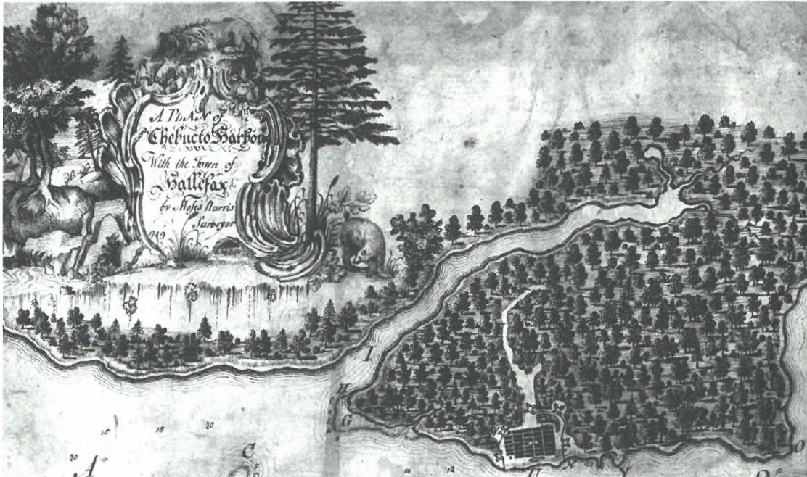
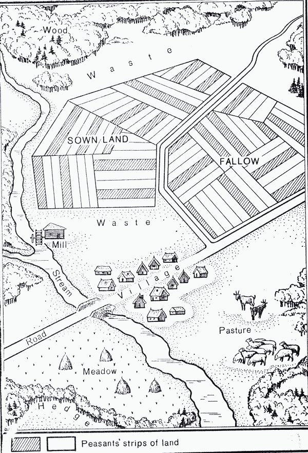
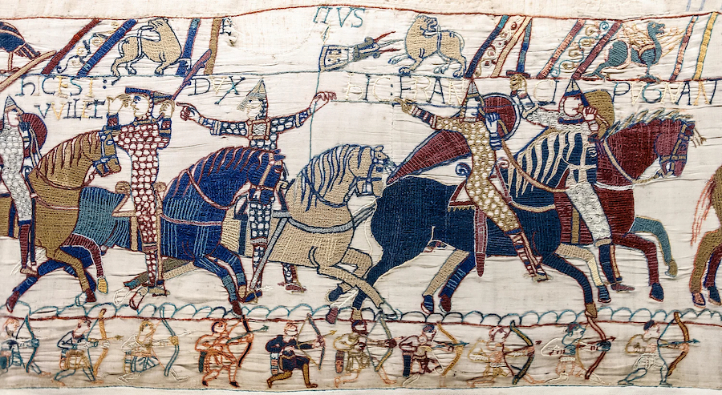
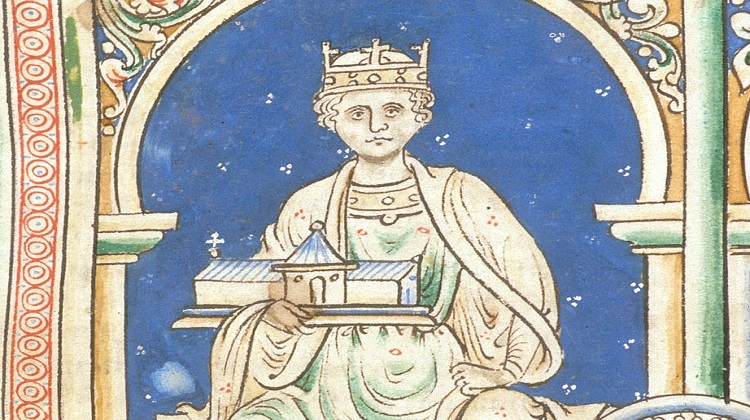
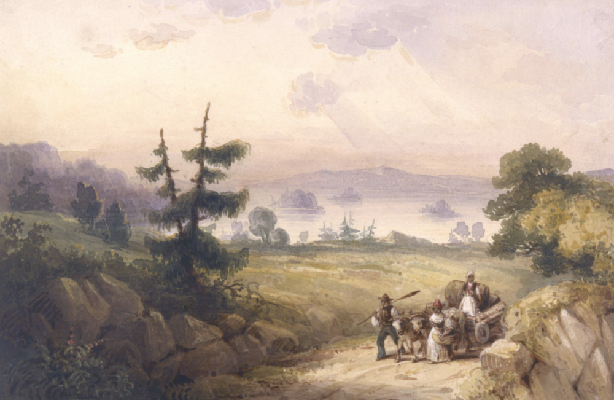
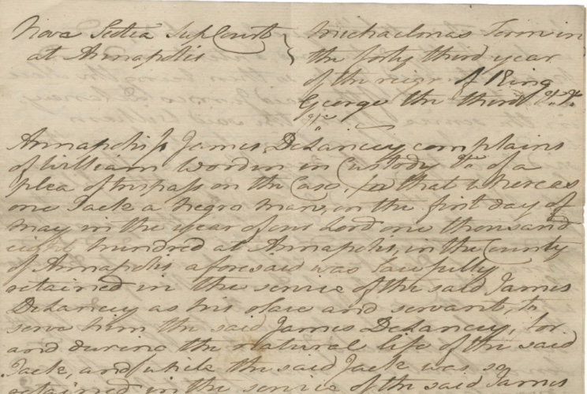

# What is Law?

Anglo-Canadian Legal Systems

<aside class="notes">

My task today is to talk with you about our question "What is law?" in context of Anglo-Canadian legal systems.

- By "anglo-Canadian legal systems" I mean the legal regimes in English Canada that have their primary roots in British law stretching back to the medieval period

- These systems are distinct from the systems of Indigenous law you heard about this morning from Prof. Simon, and they are distinct again from the system of civil law in Quebec 

- I am saying "systems of law" rather than "a system" because one of the ideas I want to challenge today is that it is useful/helpful to talk about about a single, unified, coherent system (as opposed to many interrelated systems that are often local and tied to place)

---

## Agenda

1. Rule of Law
2. Myths of Anglo-Canadian law

---

## The Rule of Law

<aside class="notes">

Ask students: what does this mean? 

</aside>

--

### The Rule of Law

"People being governed by measures laid down in advance in general terms and enforced equally according to the terms in which they have been publicly promulgated." (Waldron 2016)

<aside class="notes">

- seen as cornerstone of law in modern constitutional democracy
- in other words: no one is above a "legitimate" law
- traditional introduction: what makes a law "legitimate"? How do you know a legitimate law from an illegitimate one? 
- positivism vs natural law 
- would ask, e.g.: "Can a law that permits someone to enslave and own another person even be considered a legitimate law? Why or why not?" 

We are not going to enter into that debate, at least for now, because this question of "substance" vs "form" is really quite a narrow way of getting at the question "What is law?"

</aside>

--

####  Myth #1: "Rule of the *Common Law*" 
#### Myth #2: "*Rules* of Law"

<aside class="notes">

Instead, we are going to play off this idea of the "rule of law" to address the question of what Anglo-Canadian law is *not* -- I'll call these "myths of Anglo-Canadian law". 

</aside>

---

#### Myth #1: "Rule of the Common Law" 

<aside class="notes">

This first myth is one that describes Anglo-Canadian common law--or sometimes Western systems of law more generally--as universal law, the "true" system of law, the only game in town. 

How does this myth work?

</aside>

--

<small>A hunter spends all day pursuing a fox through the woods, finally shooting the animal from a distance. Before this first hunter can retrieve the body, a second hunter runs in, scoops it up, and takes it away. Who owns the fox? </small>

--

<small>A Mi'kmaw hunter spends all day pursuing *wowkwis* (fox) through the woods, finally shooting the animal from a distance. Before this first hunter can retrieve the body, a second, settler hunter runs in, scoops it up, and takes it away. Who owns the fox? </small>

--

<small>Source: england-history.org/</small>

<aside class="notes">

This myth about the "universalism" of the common law is not an accident--it is deeply rooted in the creation story of British  law. 

To explain, we need to look at a bit of this history. 

Anglo-Saxon England (small villages, local custom) -- why this arrangement of land? (soil quality, but mainly community safety)

</aside>

--

Norman Conquest (1066)

<small>Source: worldhistory.org/</small>

<aside class="notes">

- Norman Conquest (1066) -- Wm brought Norman aristocrats (driven by land)

- Advent of the feudal system = all land owned by the King and held "of" the king (feudal pyramid; strictly hierarchical, feudal incidents)

- Means to "tie" the society together in a set of rigid social relations based on entitlements to land 

- Note the significance of "one" owner of all land: all resources and power emanate from a central source; land relations are rigid and all-encompassing; little room for local variation

</aside>

--

Henry II (1154-89)

<small>Source: historiamag.com/</small>

<aside class="notes">

- Feudal land relations centered on the Crown laid the groundwork for the institutional develops of an English "common law" that could fully supplant Anglo-Saxon custom

- Henry II made two major moves: (1) system of royal, itinerant courts to dispense the "King's justice; (2) system of "writs" to control what kinds of claims people could make in court 

- E.g. action in Trover (Conversion) -- if someone took your personal property, you would bring this action to recover damages for the value of your property. But if you wanted to get the property back itself, you would need a different writ (replevin)

- Common law developed through these royal courts was explictly meant to be universal law within British jurisdiction 

</aside>

--

Doctrine of Discovery

Map of Kjipuktuk (Chebucto Harbour)(1749)

<aside class="notes">

First printed map of Halifax, by Moses Harris, soon after British settlers established an outpost in Kjipuktuk. 

ASK: what do you notice? (no depiction of Mi'kmaq presence)

Doctrine of discovery advanced the concept of *terra nullius* (land without people) and used to justify colonial settlement and claims to sovereign authority in British North America. 

Landing point: long process of rejecting the discovery doctrine, questioning some of the most basic assumptions behind colonialism, and trying to find ways to address its injustices and work toward mutual co-existence.  

That project is certainly an unfinished one. 

</aside>

--

#### Myth #1: "Rule of the *Common Law*" 
#### Myth #2: "*Rules* of Law"

---

### Myth #2: "The *Rules* of Law" 

<aside class="notes">

This second myth offers a different perspective on the question of "What law is".

It relates to the idea--which many students bring with them to law school--that what law "is" is predominantly a set of rules. Complicated rules to be sure, sometimes expressed in Latin, but rules that are nevertheless there to learn and use as the main part of the lawyer's craft. 

It follows that students often come to law school with the expectation that "rules" will be the main focus of their study. 

And because of this, they approach the study of law mainly as a technical exercise. Better lawyers are those with a stronger mastery of the rules and their application. 

Why is this a "myth"? *Isn't* law really about rules? To help explain this myth, I asked you to read Barrington Walker's piece, "From Property Right to Citizenship" 

</aside>

--

#### African Nova Scotian Legal History

<small>"Bedford Basin", Robert Peltey (1835)  Source: Nova Scotia Archives</small>

<aside class="notes">

You will be learning a lot more this year about African Nova Scotians and the law in your ANS/CRT course and in other courses. 

Learning the history and contemporary context of African Nova Scotians forms an essential piece of the context for Anglo-Canadian law situated here in Nova Scotia and Atlantic Canada. 

I want to take the opportunity to build a connection between our question today, "what is law", and this important larger body of knowledge you'll acquire this year.

As many of you will know, Nova Scotia is home to Canada's oldest Black communities, known as African Nova Scotian communities. There are more than 50 historical African Nova Scotian communities located across the province.

African Nova Scotians arrived in the province centuries ago, either through enslavement or by escaping enslavement elsewhere. And since that time, African Nova Scotians have faced persistent structural, systemic, and individual anti-Black racism and discrimination, which has compounded across generations.

Barrington Walker:

(1) asks the question of how the social history of African Nova Scotians is bound up with law.

(2) argues that this relationship (historically and today) is profoundly shaped by the era of European empire and and enslavement of Black people.

How should we understand what law is doing here?

</aside>

--

Was there a rule in Nova Scotia that permitted white Europeans to own Black slaves? 

<aside class="notes">

Back to our myth. If we start with the equivalency between "law" and "rules", we might ask this question. 

That is, we would start by searching for the rule or set of rules that authorized and enable the practice of slavery, and we might then focus on the workings of the state and the society at the time that led to the enactment of that rule. 

We might then come back to the "rule of law" conversation I mentioned at the outset--about whether such a rule, even if properly enacted, could ever be considered legitimate (b/c e.g. it is so abhorrent to basic values of human dignity and equality)

But if there was no such rule (e.g. no piece of provincial legislation authorizing slavery), what was the significance of law? What did law "do" here?

</aside>

--

### *Imperial Act* (1790)

Allowing for the duty-free import of Black slaves, household furniture, utensils of husbandry, or clothing. 

<aside class="notes">

Imperial legislation passed by British parliament. 

Provides a stark contrast to the accepted narrative of Canada as a safe haven from slavery and racism. 

Law renders Black people as commodities rather than citizens.

While such a law does not have any formal bearing on the question of whether slave ownership in Nova Scotia was itself "legal", it has a powerful effect in the construction of Black peoples' social identities and indeed on their very status as human beings.

</aside>

--

#### *DeLancey v Woodin*, SCNS (1803)

<small>Statement of Claim. Source: Nova Scotia Archives</small>

<aside class="notes">

Plaintiff James DeLancey (an Annapolis councillor and slave owner) sues William Woodin in trover (RECALL from earlier). 

Jack, one of DeLancey's slaves, runs away and begins to work (for pay) for Woodin. 

ASK: why does DeLancey sue in trover? Because Woodin's lawyer successfully argues that Jack is a freeman under the laws of Nova Scotia (there are none to the contrary), so Delancey cannot bring a claim that would see Jack returned to slavery.

BUT, DeLancey is successful in his trover claim--which only permits an award of damages for "wrongfully retained" property. 

SO, court both sustains the argument that Jack is a freeman and sanctions the idea of Jack as property. 

ASK: what is the "rule" here? There seems to be a fundamental contraction at the heart of this case (and with the Imperial Act, 1790)--one that a simple focus on rules cannot help us to resolve. 

</aside>

--

"Ambiguity thus lies at the heart of the Black Canadian legal odyssey..." (Walker, 3)

<aside class="notes">

Lessons:

- Much as they are important in some respects, "rules" in law are more often than not ambiguous. 

- Be careful, when answering the question "what is law", of dealing with this question in isolation and treating individuals and communities as simply passive subjects of the law as given. 

- Walker points out that the ambiguities in the law that shaped slavery and later the emancipation of African Nova Scotians were as much the product of social resistance by them and other Black Canadians as any inherent features of the law itself. 

- But at the same time, much of this ambiguity would carry over into the post-emancipation period and beyond: "Black citizenship – was forged in the precarious space between legal equality and social inequality, with the latter profoundly affecting the quality and scope of the former." (Walker)

- "An instrument of social justice, the law was also (albeit tacitly and often passively) precisely the instrument that allowed the white supremacist order to thrive"

Two other notes linking back to Myth #1:

- Notice from Walker's description how decentralized the law on slavery was across the British colonies = local

- Notice the role of custom here: much of what sustained the practices of slavery in Nova Scotia were the result of long-held customs that, while not entirely sanctioned by the courts, were also not refuted by them. 

</aside>

--

### Rule of Law

--

- "rule of law" ideal depends very much on who is recognized as properly a citizen or subject of law 

- law is "constitutive" of social relations, economic institutions, etc ; e.g. contemporary systemic racism constituted by the construction of slavey in Canada in the absence of clear law about what was allowed and what was not 

BUT we also can't do more than that: the answer to the question "What is Anglo-Canadian law?" must be grounded in a particular time and place. In the deepest sense, "all law is local" from the perspective of those who experience it. 

---

