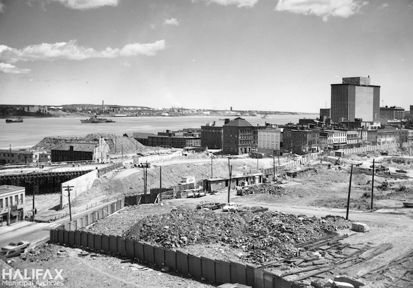
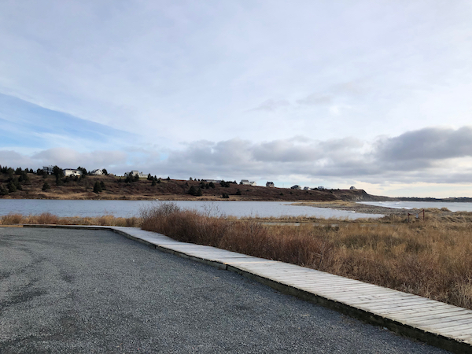
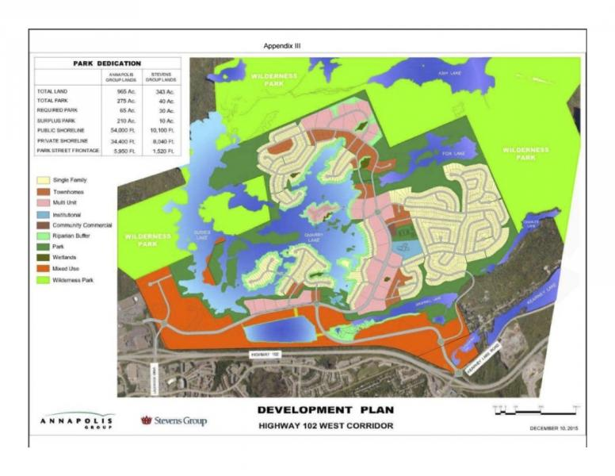

## Property, Planning & "Takings"

Jamie Baxter, Schulich School of Law

Mar 11, 2024

--

<small>Construction of Cogswell Interchange, 1968.   Source: Halifax Municipal Archives, 102-16N-0068.21</small>

--

<small>Arbutus Corridor, Vancouver, 2014.   Source: Rob Newell, Vancouver is Awesome</small>

<aside class="notes">

- CPR stopped using in 2001

- Widely used by pedestrians, cyclists, community gardeners, etc.

- Several years of discussions between CPR and City about converting to light rail, but negotiations fell apart.

- CPR explores parcelling off to private buyers; City enacts planning bylaw to limit use of corridor to "transportation uses" but doesn't buy the land. 

</aside>

--

## *De facto* Expropriation 

(or "regulatory takings")

<aside class="notes">

- Important legal issue for planners (e.g., impact of land-use regs) as a matter of "public law"

- But also basically an issue of property rights: how "big" or "strong" are private rights to property in Canada? When can the state override those rights, through law, without at least paying owners for any harm they might suffer? 

- From local govs perspective: much of this is about the COST of land-use regulation 

</aside>

--

## Agenda:

1. Property rights 
2. Legal framework
3. Caselaw 

---

<small>Imagine that you inherit a heritage building in downtown Halifax. You can't modify, destroy or even sell it without special permission from the City. In what sense do you "own" the building? In what sense do you not?</small>

--

<small>The "bundle of sticks"</small>

<aside class="notes">

- Used to describe "ownership"
- Helpful for understanding the *de facto* "takings" problem
- Does the bundle include limits/obligations (per *Mariner*)?

</aside>

---

### Legal Framework for "Takings" 

- constitution <i class="fa fa-check"></i>
- legislation <i class="fa fa-check"></i>
- case law <i class="fa fa-check"></i>
- int'll trade agreements <i class="fa fa-check"></i>

--

#### Which section of the *Charter of Rights* protects private property rights in Canada?

--

### <i class="fa fa-file"></i> *Expropriation Act*, RSNS 1989, c 156 

> 24\. Where land is expropriated, the statutory authority **shall** pay the owner compensation as is determined in accordance with this Act.

---

#### *Mariner Real Estate Ltd v Nova Scotia*

--

### *Mariner*/*CPR* test <i class="fa fa-vial"></i>

1. Acquisition of a beneficial interest in the property or flowing from it, and 

2. Removal of all reasonable uses of the property

--

#### *Annapolis Group v HRM*

--

### *Annapolis Group* test <i class="fa fa-vial"></i>

1. Acquisition of an **advantage** to the state, and 

2. Removal of all reasonable uses of the property

<aside class="notes">

- acquisition of an advantage rather than actual interest in land

- focus is on the *effect* of the regulation on the landower (i.e. not on whether an interest actually acquired by the state)

- addition of "owner's reasonable expectations" to "nature of land and its historical uses" (from Mariner)

</aside>

---

<small>Conceptual drawing, Arbutus Corridor. Source: City of Vancouver</small>

---

<small>To what extent would the *Annapolis Group* have a better chance at compensation, on the same facts, if it were an American or Mexican corporation? </small>