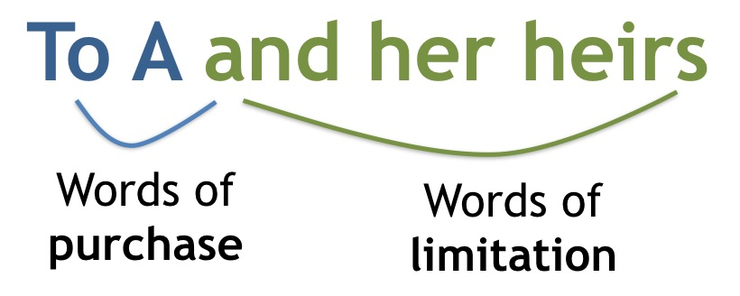

# Class 2

Fee Simple

--

## Agenda

1. Review: Common Law Land Tenure
2. Doctrine of Estates
3. Fee Simple
4. Common Law and Statutory Rules: *Thomas v Murphy*

---

### Estates in Land

**"To Y and their heirs."**

<aside class="notes">

- Doctrine of tenure = Crown's radical title = absolute ownership impossible
- "Estates" created to give some meaning to "ownership" within feudal system
- Functional purpose: divide *present* ownership in land over time 
- Closed categories = not possible to create new kinds of estates (flexibility vs rigidity)

</aside>

---

### Fee Simple

"Largest estate known to the common law"

<aside class="notes">

- "largest estate" (compare to life estate)

- Fee simple (fee = does not end with death of owner; simple = no limit on which heirs can inherit) is closest to “full ownership” in common law system

Ellickson: conservation rationale = perpetual ownership allows current owners to capitalize costs and benefits into their land-use decisions

- Counter-example? Farmland leases.

Shoemaker: perpetual ownership is a form of power and control to sustain intergenerational wealth (and therefore exclude others)

- Makes early allocations of land rights (or taking them by force or violence) extermely consequential 

Colonial land relations (Liboiron): consider how perpetual ownership leads to ahistoricism = Ellickson and Shoemaker's stories are both forward looking - fee simple allows current owners to ignore history of the land 

</aside>

--

### Terms

- “Estate in land” vs “deceased’s estate” vs “my country estate”  
- Grant/Grantor/Grantee  
- Devise/Testator/Donee 

--

### Exercise

According to the traditional common law rule described in *Thomas v Murphy*, which of the following clauses in an *inter vivos* grant of land are sufficient to transfer the entire fee simple interest:  

- “To Y in fee simple”  
- “To Y”  
- “To Y and their heirs”  
- “To Y, their successors and assigns” 

--

### *Thomas v Murphy*

**"To Y and their heirs."**

<aside class="notes">

Thomas purchases a piece of land from a seller (Y, “grantee”), who in turn received it through a grant from X (“grantor”)

Claim is that the transfer from X to Y was DEFECTIVE b/c it contained the phrase “to Y, their successors and assigns” rather than “to Y, their HEIRS, successors and assigns”

Murphy is Thomas’ lawyer. Thomas is suing b/c Murphy didn’t catch the problem and Thomas had to pay a bunch of money to get it fixed

Common law rule for grants = “magic words” are required (strict rule of law); any other phrasing would only create a life estate

Common law rule for wills/devise = presumption of life estate could be rebutted by gleaning testator’s intention from the will as a whole (i.e. b/c grantor not around to clarify the situation; property needs to go somewhere) (rule of construction)

</aside>

--

<aside class="notes">

“To Y” = words of purchase (i.e. who estate vests in)

“and her heirs” = words of limitation (i.e. what kind of estate)

- even though refers to certain people, they do not get any entitlements

</aside> 

--

### *Conveyancing Act*, RSNS 1989, c 97

<small>

13 Except where a contrary intention appears by the conveyance,

(a)  where words of limitation are not used, the conveyance conveys the whole property right that the party conveying had power to dispose of by the conveyance, including, in the case of real property, the fee simple;

</small>

--

### *Wills Act*, RSNS 1989, c 505

<small>

27 Where any real property is devised to any person without any words of limitation, such devise shall be construed to pass the fee simple or other the whole estate or interest which the testator had power to dispose of by will in such real property, unless a contrary intention appears by the will.

</small>

---

### Next Class

**“To Y and their heirs, then to W and their heirs.”**

