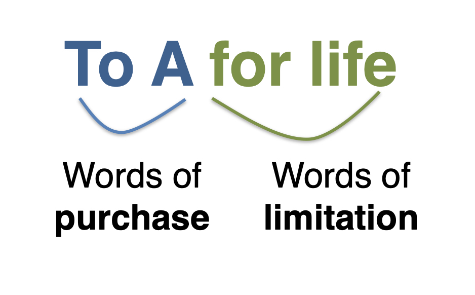

# Class 2.2

Life Estate

--

## Life Estate

--

### X Holds *Reversion*

X grants: "To A for Life"

--

### B Holds *Remainder*

X grants: "To A for life, then to B"

--

### What do B and C hold?

X grants: "To A for life, then to B for life, then to C"

--

## Doctrine of Waste

How to prevent the life tenant from depleting the value of the estate (recall *Ellickson*)?

---

## Interpretation and Construction

--

## A Puzzle

X grants: "To A and their heirs, then to B and their heirs." 

--

### *Re Walker* (1924)

> “I give and devise unto my said wife all my real and personal property ... and also should any portion of my estate still remain in the hands of my said wife at the time of her decease undisposed of by her, such remainder shall be divided as follows ...”

--

### *Re Taylor* (1982)

> “I give, devise and bequeath all my real and personal estate of which I die possessed to my wife Kate ... to have and use during her lifetime ... Any estate of which she may be possessed at the time of her death is to be divided equally between my daughters ...”

--

### *Christensen v Martini Estate* (1999) 

> “I give to my wife ... 2203 31 Ave ... for her use. When she no longer needs 2203 31 Ave. ... that she give said property to Sandra and Sonya  ...”