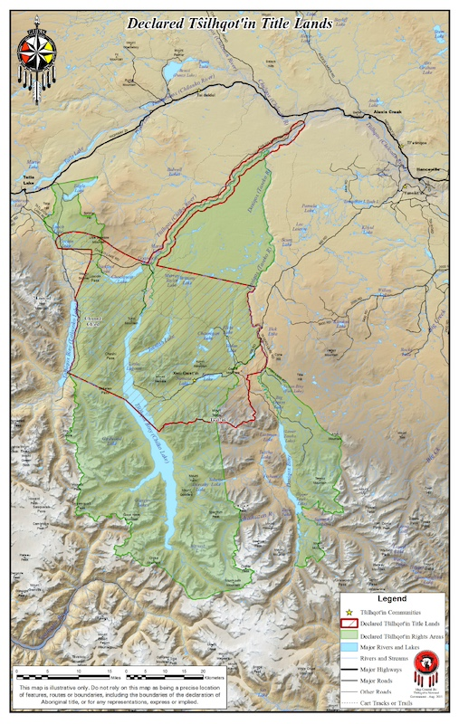

# Class 2.3

Common Law Aboriginal Title

--

## Agenda

1. Review: Life Estate
2. Context & Overview
3. Source
4. Nature and Content
5. Proof
6. Infringement 
7. *Terra Nullius* 

---

### Aboriginal Title and Colonial Land Relations

- *Universalism*
- *Ahistoricism*

<aside class="notes">

KEY POINT: common law doctrine of Aboriginal title is "difficult, muddy ground"

- It reproduces much of how Anglo-Canadian property law has advanced and perpetuated colonial land relations
- Optimists: it may open up space to move beyond dynamics of universalism and ahistoricism  

</aside>

--

## Overview

- Royal Proclamation, 1763
- *St. Catherine's Milling* (1888)
- *Calder v British Columbia* (1973)
- *Delgamuukw v British Columbia* (1997)
- *Tsilhqot'in v British Columbia* (2014)

<aside class="notes">

- RP1763: followed Treaty of Paris (French lost 7 years war and ceded colonial claims to Britain in BNA); attempt to formalize relationship between British Crown and Indigenous nations (recognition of land rights; nation-to-nation relationship)

- *St. Catherine's Milling* (1888): Treaty 3 (Anishinaabe/Salteaux, 1873); Confederation in 1867 = who held property rights in Crown lands (province/Canada); raised question of common law status of Aboriginal title (Indian title) 

- *Calder*: backlash against federal "white paper" and assimilationist agenda of PE Trudeau; SCC splits but recognizes AT as rights in land

- *Delgamuukw*: first major SCC decision after AT gains constitutional protection under section 35

- *Tsilhqot'in*: first SCC decision where claimant nation succeeds in proving title 

</aside>

--

## Litigation Context

<aside class="notes">

- huge cases: expensive, time-consuming, uncertain 
- understand in relation to negotiation/treaty-making processes 

</aside>

---

### *St. Catherine's Milling*

- Source of Aboriginal title: Royal Proclamation, 1763

- Content of Aboriginal title: "personal and usufructory right", "dependent on the goodwill of the sovereign" that is inalienable, except to the Crown

- Surrender or extinguishment of Aboriginal title: can be "surrendered or otherwise extinguished"

--

### Source: *Delgamuukw*/*Tsilhqot'in*

1. Occupation prior to the assumption of Crown sovereignty; and

2. Relationship between common law and Indigenous law

---

## Nature & Content

Is Aboriginal title like a common law estate in land? Why or why not?

<aside class="notes">

Key point: students should recognize that fee simple is not the "ideal model" - AT as jurisdiction (Hana, Tsilhqot'in law)? 

- NB p 441 discussion of comparison to fee simple

</aside>

--

### Aboriginal Title is...

1. *Sui generis*

2. Beneficial interest in land that includes right to exclusive use and occupation

3. Inalienable 

4. Inherently limited

5. Communal

---

## Test for Proof of Title

1. Sufficient

2. Continuous

3. Exclusive

--

### Sufficiency

Occupation must be sufficient to ground Aboriginal title. 

<aside class="notes">

- "The question of sufficient occupation must be approached from both the common law perspective and the Aboriginal perspective"

- "The Aboriginal perspective focuses on laws, practices, customs and traditions of the group. In considering this perspective for the purpose of Aboriginal title, “one must take into account the group’s size, manner of life, material resources, and technological abilities, and the character of the lands claimed"

- "The common law perspective imports the idea of possession and control of the lands. At common law, possession extends beyond sites that are physically occupied, like a house, to surrounding lands that are used and over which effective control is exercised."

- Result: "territorial" vs "site-specific" test 

</aside>

--

### Tsilhqot'in Law (Hana)

Seasonal round as process of renewing reciprocal obligations in relationships to the land and territory. 

<aside class="notes">

Process of acquiring jurisdiction over Tsilhqot'in territory through the seasonal round:

- Creation of reciprocal obligations in relationships through gift exchange rather than social contract (e.g. through creation of new animals; cyclical renewal of obligations)
- Acquisition of power over other inhabitants -- something that can be both gained and lost (see: cyclical renewal)

Very different interpretation of lifeways compared characterization of "nomadic lifestyle" 

ASK: what kind of "evidence" might the court look for if it used Tsilhqot'in Law as the "test" for sufficiency? 

</aside>

--

### Continuity

Where present occupation is relied on as proof of occupation pre-sovereignty there must be continuity between present and pre-sovereignty occupation.

--

### Exclusivity

There must have ben exclusive occupation of the land at the time of sovereignty (intention and capacity to retain exclusive control). 

<aside class="notes">

Challenge for future cases: what about overlapping claims? 

</aside>

---

## Infringement

Crown must show:

- it has discharged its duty to consult and accommodate;
- has a compelling and substantial objective
- action is consistent with Crown's fiduciary obligation 

<aside class="notes">

Key point: section 35 outside the scope of s. 1 yet Oakes-like test

NB quote on 443 from Lamer CJ re what activities could justify infringement 

Link to *terra nullius* 

</aside>

---

### *Terra Nullius*

<small>

At the time of assertion of European sovereignty, the Crown acquired radical or underlying title to all the land in the province. This Crown title, however, was burdened by the pre-existing legal rights of Aboriginal people who occupied and used the land prior to European arrival. The doctrine of *terra nullius* (that no one owned the land prior to European assertion of sovereignty) never applied in Canada, as confirmed by the Royal Proclamation (1763), R.S.C. 1985, App. II, No. 1. (*Tsilhqot'in*, para 70)

</small>

<aside class="notes">

- basis for decision in *St. Catherines Milling* and self-justification for much of Crown's dealings with Indigenous peoples 

SCC appears to reject the doctrine in Tshilqot'in, but:

- remains the basis for Crown's power to "infringe" on AT
- AT is not assumed to exist (like Crown sovereignty and underlying title) 

</aside>