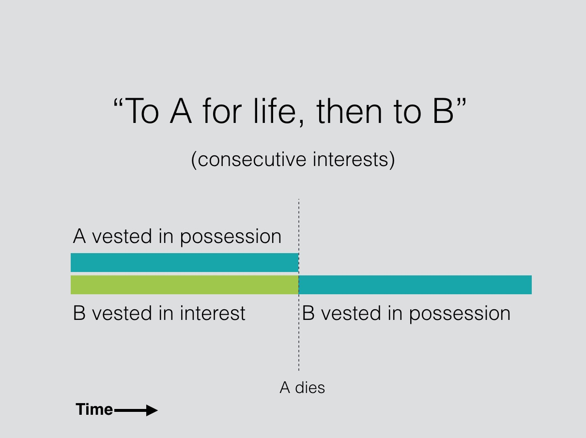
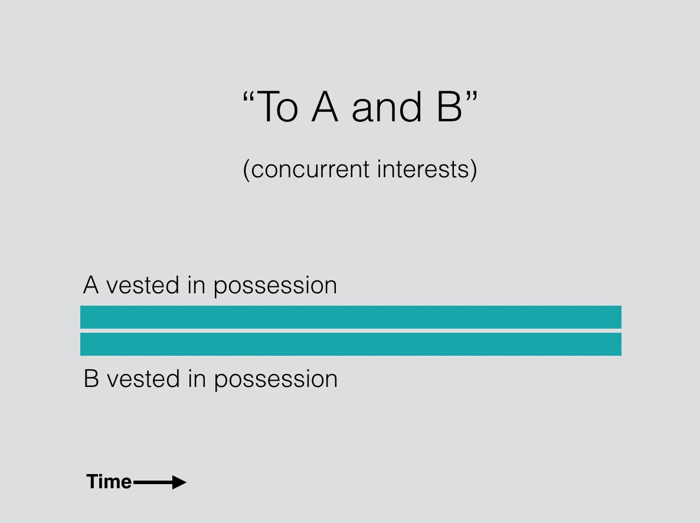
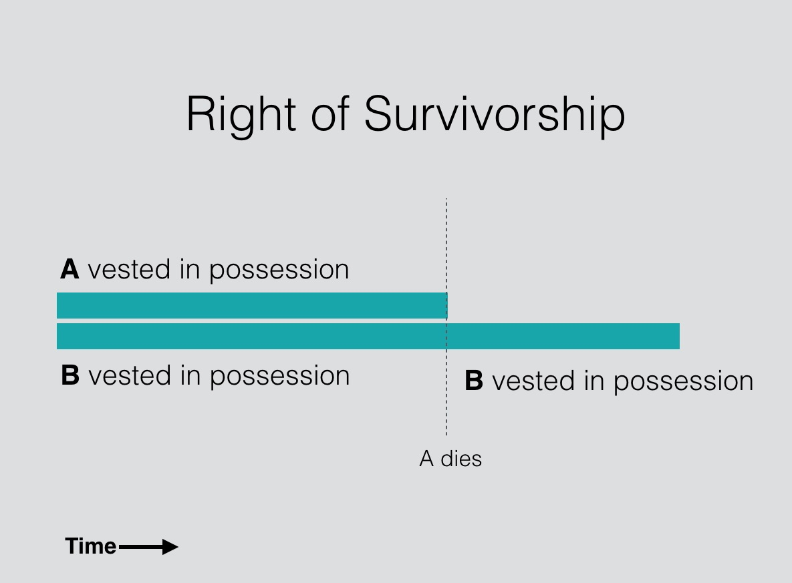

# Class 3.1

Shared Ownership

--

## Agenda

1. Intro to shared ownership
2. Creation

---

"To A for life, then to B"

"To A and B"

--

--

--

### "Governance Property"

- Link to colonialism themes (*universalism*, *ahistoricism*)

---

### Two types of shared interests:

1. Joint tenancy
2. Tenancy in common

**How to distinguish?**

--

--

### Four Unities

Possession, interest, title and time.

---

### Creation: *Robb v Robb*

What are the different consequences for Mary Robb and for George Robb's children if the leasehold interest is held in **joint tenancy** VS **tenancy in common**?

<aside class="notes">

Principles:

- Common law presumption in favour of JT (WHY?)

- Three exceptions to presumption: (1) two or more persons advance money on a mortgage; (2) partnership property is presumed TIC; AND (3) where purchase price of property is provided unequally 

Court finds:

- Because the purchase of a subsequent property in California by George Robb, on the evidence, in consideration for the fact that Mary paid for the leasehold, Court finds that presumption of TIC where uneven contribution to purchase price is rebutted - therefore, JT

- Court further finds that statutory provision shifting presumption in favour of TIC doesn't apply to assignment of a lease 

ASK: How would *Robb v Robb* be decided in NS?

</aside>

--

###	*Real Property Act*, RSNS 1989 c 385, s 5

> 5 (1) Every estate granted or devised to two or more persons in their own right shall be a tenancy in common, unless expressly declared to be in joint tenancy but every estate vested in trustees or executors as such shall be held by them in joint tenancy.
>
> (2) This Section shall apply as well to estates already created or vested as to estates hereafter to be granted or devised.

<aside class="notes">

ANSWER: leasehold interest in Robb v Robb would be in TIC by application of this statute (leasehold interest is a kind of estate -- BC statute only applied to fee simple) 

</aside>

