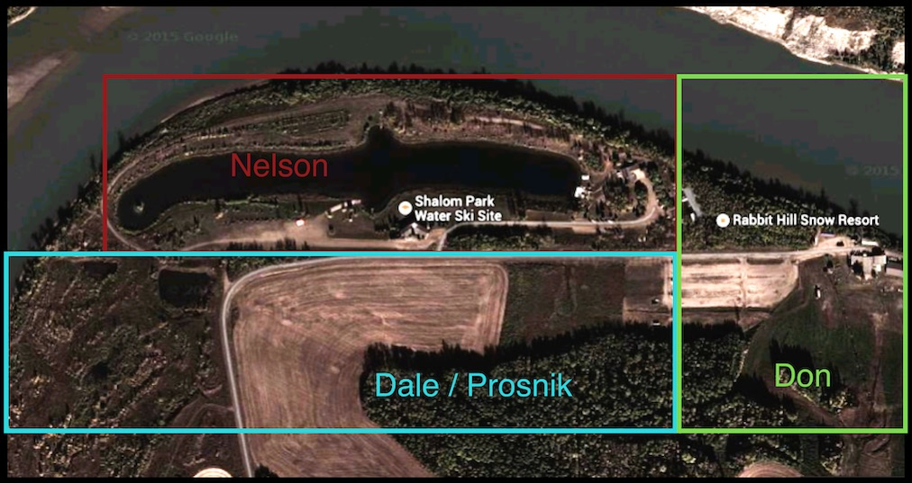
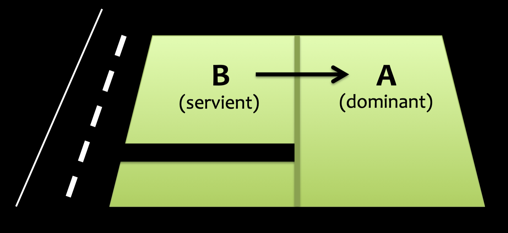
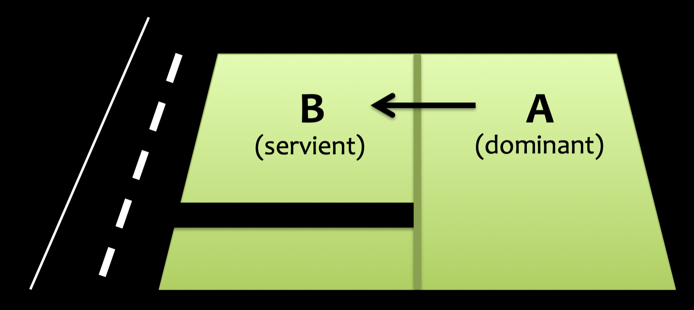
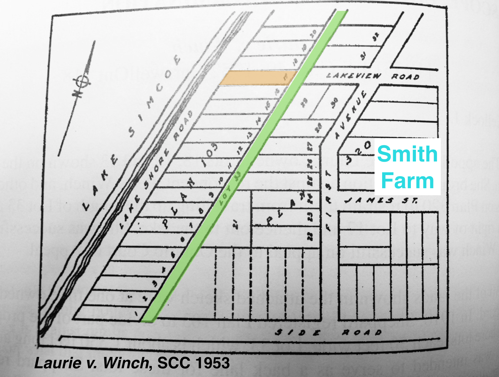
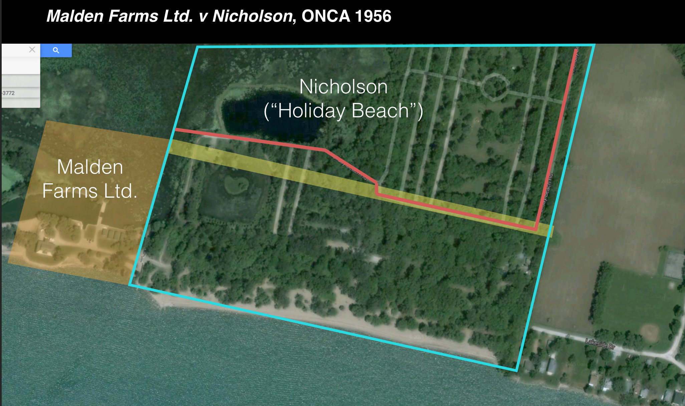

# Class 4.1

Easements

--

## Agenda

1. Definitions

2. Creating Easements

3. Scope of Easements

---

### What is an easement?

An easement is a right that one landowner can exercise over or in relation to another’s land.

<aside class="notes">

- so far we've have studied property rights that one or more owners can hold in respect of their own lands. 
- easement is something different: it is a set of property rights that one landowner holds in respect of someone else’s land. 
- e.g., “right of way” over a neighbour’s land—for example, the right to walk over that neighbour’s land to get to the beach. 

If A holds a right of way over a narrow path running over their neighbour’s (B’s) land, B of course retains ownership of the underlying title in that land. More specifically, B remains vested in possession of their land. For this reason, we sometimes refer to easements as a “non-possessory” interest in land.

</aside>

--

### *Nelson v 11535696 Alberta*

<aside class="notes">

Facts:

Two commercial resorts located on land that is inaccessible by county roads

Rabbit Hill Ski had land lease from original landowner (Don Stelter); resort built road across adjoining lands (Dale Stelter)

When road was completed (1972), Dale Stelter leased the road to Rabbit Hill

1985 - Nelson purchased lands to north of Stelter lands and built Shalom park; accessible only by crossing Stelter lands (no permission and not party to road lease)

2005 - Proznik buys Dale Stelter’s lands and attempts to bar Nelson from road

Nelson is trying to maintain access to the road - claims:

- easement (“necessity”)

- public highway (“dedicated” by Dale Stelter) — we won’t cover in detail: need (1) intention to dedicate; (2) way “thrown open”

</aside>

--

### Dominant vs Servient Lands

Benefits --> Dominant

Burdens --> Servient

<aside class="notes">

E.g. Nelson v 1153 Alta: Nelson’s land is the DOMINANT (benefits form road); Dale Stelter/Prosnik’s land is SERVIENT (burdened by road)

</aside>

--

#### *Conveyancing Act*, RSNS 1989, c 97

<small style="text-align: left;">

13 Except where a contrary intention appears by the conveyance, […]

(d) a conveyance of any property right in land includes the buildings, **easements**, tenements, hereditaments and appurtenances belonging or in anywise appertaining to that property right.

</small>

<aside class="notes">

Common law idea that easements "run with the land" is now codified in statute. 

DURATION: Unless easement created for a limited time period or is extinguished, the benefit of the easement will always run with the dominant land and the burden of the easement will always run with the servient land.

</aside>

---

### Creating Easements

- Validity  
- Express Grant or Reservation  
- Implied Grant  
- Prescription 

--

### Validity (*Re Ellenborough Park*)

1. Existence of dominant and servient lands;

2. Ownership of dominant and servient lands by different parties;

3. Benefit to the dominant lands; and

4. Rights granted are sufficiently clear and not too broad in scope.

<aside class="notes">

Fourth requirement means:

- Right granted by easement is sufficiently well delineated (i.e. not too vague)

- Right is not so broad in scope that it amounts to ownership or full possession of servient lands

</aside>

--

### Express Grant

--

### Express Reservation

<aside class="notes">

Express Reservation: Owner of a parcel expressly reserves right to exercise an easement over another parcel.

EXAMPLE: A owns entire parcel, severs the “west” half of the land and sells to B.

- If in the conveyance A reserves right of way over B’s land, this creates an easement by express reservation.

</aside>

--

## Implied Grant (*Wheeldon v Borrows*)

1. Easement must have been used by the original landowner at the time when the land was severed into dominant and servient lands;

2. Use of the easement must have been continuous and apparent; and

3. Easement must be related to the reasonable enjoyment of the dominant lands.

<aside class="notes">

KEY IDEA: even if there is not express grant or reservation, easement might be implied by law.

</aside>

--

### Implied Grant (Necessity)

<aside class="notes">

No express grant or reservation in Nelson--claim is based on a type of implied grant called an "easement of necessity" (no other way for him to access the land)

Necessity is seven more difficult to prove than the *Wheeldon* test:

1. absolutely necessary for the use of the dominant lands and
2. necessity existed at the time when the land was severed. 

The two judges in Nelson clearly disagree about how broadly easements of necessity should be available.

Justice Papery (easement along the existing road is necessary):

- new evidence on appeal that all lands were originally in Crown ownership and Nelson lands were LANDLOCKED at time when title was severed (and remain so)

Justice McDonald (no easement of necessity):

- easement of necessity must be confined to use of land at the time when easement arose (i.e. when land was severed) … “inconceivable” that original easement would have tracked the EXACT ROUTE of the road

Raises question about BASIS for an easement of necessity: IMPUTED INTENTION of original landowner or based on PUBLIC POLICY (against wasting land)

</aside>

--

### Prescription

<aside class="notes">

Easement acquired by use (rather than by an express or implied grant or reservation).

Similar to adverse possession, in the sense that a period of use that is open, peaceful and without consent can give rise to enforceable property rights (e.g. right of way over servient lands)

Based on theory that if right of way had been used for a very long time, this was evidence of an actual grant of easement that had been “lost in time” (doctrine of “lost modern grant”)

Today, where easements by prescription still exist, period of continuous use has been regularized (e.g. 20 years in NS)

Abolished altogether in some jurisdictions.

PROBLEM: similar to worries about easements of necessity, prescriptive easements can create some uncertainty in an era that is increasingly worried about certainty of title

</aside>

--

#### *Land Registration Act*, SNS 2001, c 6-1

<small style="text-align: left;">

74 (1) Except as provided by Section 75, no person may obtain an interest in any parcel registered pursuant to this Act by adverse possession or prescription unless the required period of adverse possession or prescription was completed before the parcel was first registered.

(2) Any interest in a parcel acquired by adverse possession or prescription before the date the parcel is first registered pursuant to this Act is absolutely void against the registered owner of the parcel in which the interest is claimed ten years after the parcel is first registered pursuant to this Act, …

</small>

<aside class="notes">

As we will see in next unit, prescription (and adverse possession) remain limited exception to principle of “indefeasible title”

As with adverse possession, s 74 requires 20-year period of prescription to be completed prior to first registration

Claim to prescription must be made within 10 years of first registration

BUT: section 75 would seem to make ongoing prescription claims more viable between neighbours — as long as easement does not exceed 20% of area of servient lands (which is more likely for right of way than AP claim)

</aside>

---

## Scope of Easements

<aside class="notes">

EXAMPLE: right of way that was once a country path is now a 4-lane highway — does this use still fall within the scope of the original easement?

PRINCIPLE: Owner of dominant lands cannot – without consent of servient owner – increase or expand easement beyond scope of grant (or, where easement based on implied or prescriptive rights, beyond accustomed use)

Excessive use of an easement = trespass

</aside>

--

### *Laurie v Winch*

<aside class="notes">

Whole plot is originally a farm.

Plan 103 - waterfront subdivision created by Sheppard (1910)

Lot 33 - long strip lot intended to be used as a back lane for subdivision

Lot 17 - farm lane running between Lake Shore Rd and the farm on eastern half, over Lot 33 (gated at both ends)

Plan 320 - farm sold by Sheppard to Smith (1917)

Smith later purchases lot 17, and in 1925 acquires deed from Sheppard granting Smith a “perpetual right of way over lot 33”:

I hereby give to John Smith …. his heirs executors and assigns a perpetual right of way over Lot thirty-three (33) Plan one hundred and three (103) …. This is to be binding on my heirs executors or assigns.

1944 - Winch purchases Smith farm + Lot 17 + right of way … turns this remaining farm area into a residential subdivision as well

Now, owners of lots in Plan 320 (the new Winch subdivision) use RoW over Lot 33 to get to the beach. Laurie, current owner of Lot 33, wants to stop them from doing this. 

KEY ISSUE: what is the SCOPE of the RoW over Lot 33? Does the use of RoW by subdivision residents exceed the original scope? Has the easement been extinguished given the change in circumstances?

- Side issue: no dominant lands identified in the grant (court reads in dominant lands as 320 farm)

</aside>

--

### *Malden Farms Ltd v Nicholson*

<aside class="notes">

Two main areas: west (Malden Farms) and east (Nicholson)

Blue parcel original one tract – farm owner (Barron) grants RoW to Malden’s predecessor (Chapus et all) for road running along yellow strip.

Barron later divides blue parcel into two tracts (north and south of yellow strip) and sells these to Nicholson’s predecessor (Dayus)

Transfer included second RoW to Dayus over top of the original RoW.

Malden’s predecessor (Chapus) then purchases fee simple in yellow strip under the original RoW

Malden buys the land.

Dayus opens beach resort and arranges with Malden to move a portion of the RoW north by 300ft, but Malden retained fee in yellow strip

Dayus transfers title to Nicholson.

As a result of opening beach resort, traffic increases a great deal on the roadway covering the original RoW, also parking and picnicking along side of road on the yellow strip.

KEY ISSUE: Is Nelson’s use of the RoW “EXCESSIVE”? i.e. has the use by his customers exceeded the scope of the original grant of the easement?

</aside>

--

## Determining Scope

- Matter of degree  
- Type of use  
- Foreseeability  

<aside class="notes">

ASK: how to reconcile Malden with Laurie v Winch?

Laurie: court finds that changing use of “farm lane” is within scope of easement (no trespass)

Malden: court finds that changing use of road exceeds scope of easement (trespass)

Matter of degree?

- a bit more traffic in Laurie vs a lot more traffic in Malden

- In Malden, court regards change from “private right of way” to “use for commercial purposes by great numbers of the public…as though it constituted a public highway or busy toll road.”

Type of use?

- change from private to commercial nature in Malden; but both uses private in Laurie

- Counter-argument: wasn’t the subdivision of the farm lands in Laurie and the consequent increase in traffic over Lot 33 for a “commercial” purpose?

Foreseeability of changing use when easement was created?

- Laurie: easy to think that farm would be turned into a subdivision (one already existed on the other lot)

- Malden: not so obvious that a holiday resort might be constructed

UPSHOT: each of these may well be factors — basic principle is about parties’ intentions when easement was created (note: in Laurie, no restrictions on the face of the grant = default is that RoW is unrestricted)

</aside>

