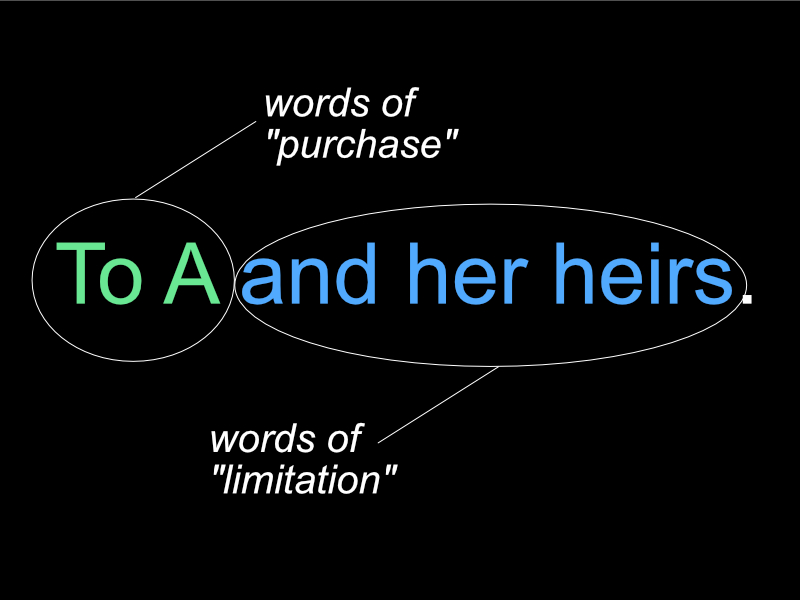

b.socrative.com/login/student

BAXTERDAL

--

X grants: "To A and her heirs"

--

--

X grants: "To A in fee simple"

--

X grants: "To A"

--

X grants: "To A for life"

--

X grants: "To A for life, then to B"

--

X grants: "To A for life, then to B for life, then to C"

*What do B and C hold?*

--

## A Puzzle

X grants: "To A in fee simple, then to B." 

--

