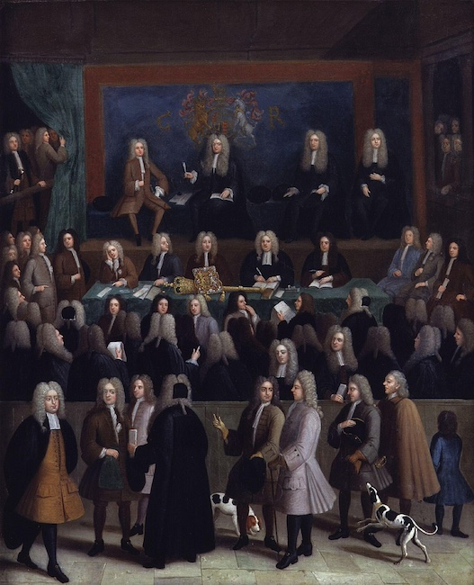
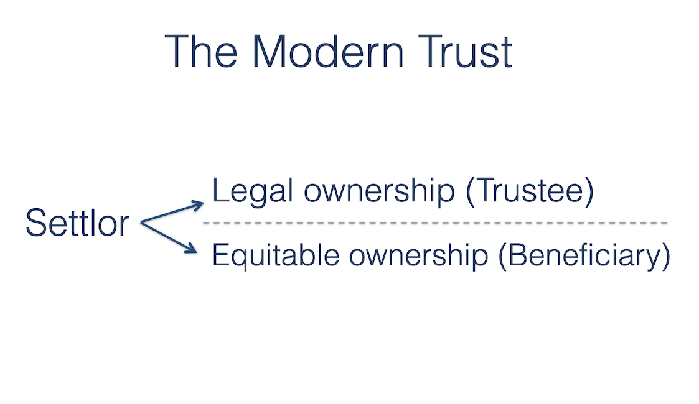
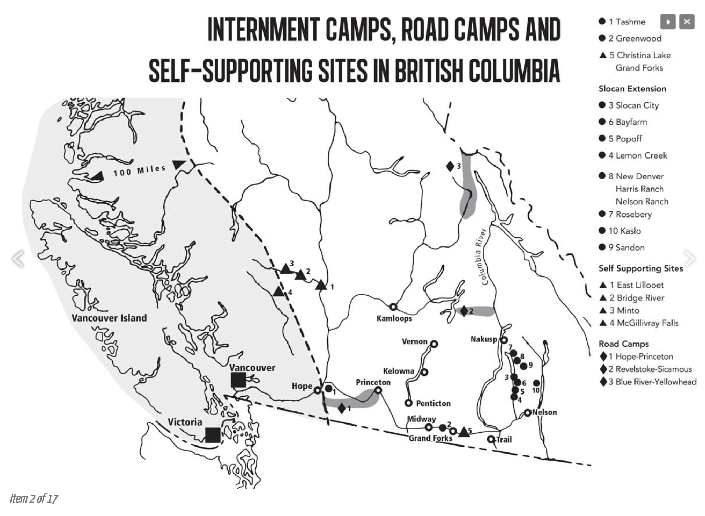
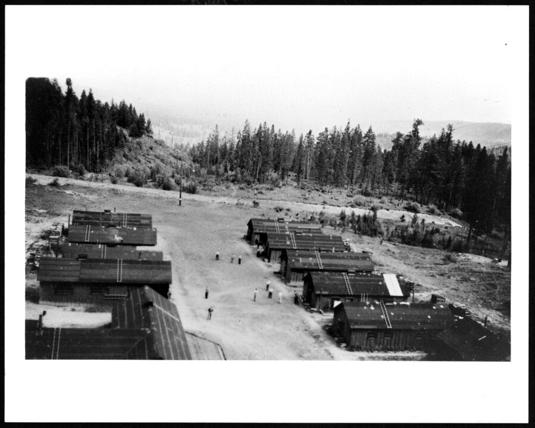

X grants: "To A and her heirs"

X grants: "To A in fee simple"

X grants: "To A"

--

X grants: "To A for life"

--

X grants: "To A for life, then to B"

--

X grants: "To A in fee simple, then to B." 

--

X grants: "To A in fee simple, but A cannot sell the land for 25 years"

--

X devises: “to T and their heirs in trust for A and her heirs”

--

### The Use

--

### Statute of Uses (1535)

--

--

X devises: “to T and their heirs in trust for A and her heirs”

--

X devises: “to T and their heirs in trust for A for life, then in trust for B and his heirs”

--

--

--

#### Order 1665

<small style="text-align: left;">

12 (1) As a **protective measure only**, all property situated in any protected area of British Columbia belonging to any person of the Japanese race resident in such area ... **shall be vested in and subject to the control and management of the Custodian** as defined in the Regulations respecting Trading with the Enemy, 1939; provided, however, that no commission shall be charged by the Custodian in respect of such control and management.

</small>

--

#### Order 2483

<small style="text-align: left;">

12 (2) The Custodian may, notwithstanding anything contained in this Regulation, order that all or any property whatsoever, situated in any protected area of British Columbia, belonging to any person of the Japanese race shall, **for the purpose of protecting the interests of the owner or any other person, be vested in the Custodian, and the Custodian shall have full power to administer such property for the benefit of all such interested persons**, and shall release such property upon being satisfied that the interests aforesaid will not be prejudiced thereby.

</small>

--

#### Order 469

<small style="text-align: left;">

... the Custodian has been vested with the **power and responsibility of controlling and managing any property** of persons of the Japanese race evacuated from the protected areas, such power and responsibility shall be deemed to include and to have included from the date of the vesting of such property in the Custodian, the **power to liquidate, sell, or otherwise dispose of such property**.

</small>

